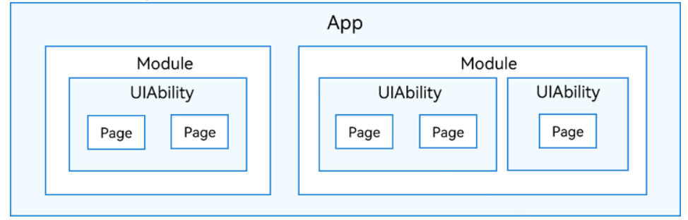
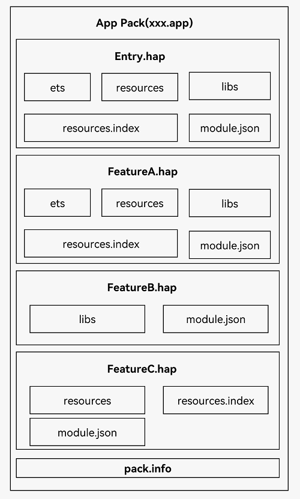
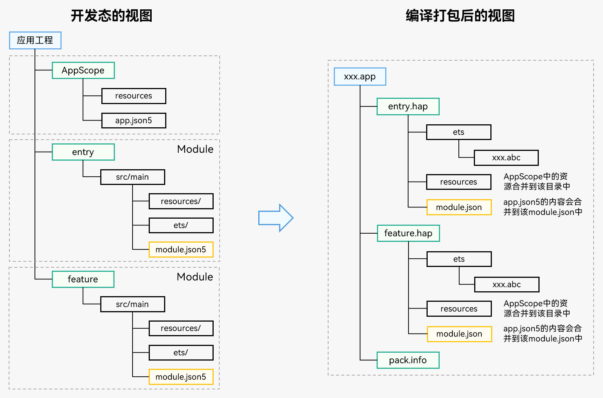
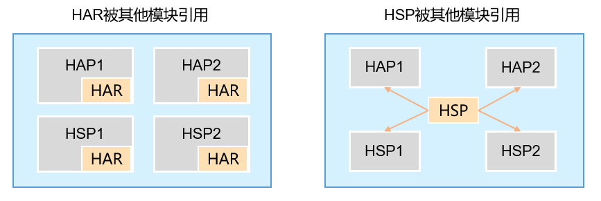

# 项目的包结构是什么样的?



- App(Application)
    
    - 一个或者多个`Module`
        - 源代码
        - 资源文件
        - 第三方库及应用
        - 服务配置文件
        - 每个`Module`可以单独编译运行
- `Module`
    
    - 根据类型不同编译后是不同的文件
        - `Ability`
            - 编译后是`HAP`(Harmony Ability Package)
        - `Library`
            - 编译后是`HAR`(Harmony Shared Package)
- `HAP`
    
    - 应用安装的基本单位
    - 编译后的代码
    - 资源
    - 三方库及配置文件
    - 有两种类型的`HAP`
        - `Entry`类型
            - 应用入口
            - 主功能
        - `Feature`类型
            - 特性模块
            - 可配成按需下载安装
- `Ability`可以是多个所以编译后的`HAP`也可以是多个
    
- 多个`HAP`打包后变为`.app`
    



# 为什么有多HAP?

- 松耦合
- 多个功能模块(收款,付款,消息,理财)
- 根据设备不同组合不同的`HAP`打包
- 减少初始包大小按需加载



# 什么是HAR?

- HAR（Harmony Archive）静态共享包
- 可以包含代码、C++库、资源和配置文件
- 多个模块或多个工程共享ArkUI组件、资源
- 不可独立安装运行

# 什么是HSP?

- HSP（Harmony Shared Package）动态共享包
- 分为应用内HSP和应用间HSP
    - 应用内HSP指的是专门为某一应用开发的HSP,只能被该应用内部其他HAP/HSP使用
    - 当前暂不支持应用间HSP，提到HSP时特指应用内HSP

# HAR和HSP区别?



- HAR 跟随使用方编译，多份
- HSP 独立编译，一个进程中代码只存在一份

# 配置文件什么作用?

- 向编译工具、操作系统和应用市场提供应用的基本信息

# 有哪些配置文件?

- app.json5
    - 应用的全局配置信息，包含应用的Bundle名称、开发厂商、版本号等基本信息
- module.json5
    - Module的基本配置信息，包含Module名称、类型、描述、支持的设备类型等基本信息
    - 应用组件信息，包含UIAbility组件和ExtensionAbility组件的描述信息
    - 应用运行过程中所需的权限信息

# 资源文件?分类?

- 资源文件
    - 颜色、字体、间距、图片等资源
- 资源分类

```
resources
|---base
|   |---element
|   |   |---string.json
|   |---media
|   |   |---icon.png
|   |---profile
|   |   |---test_profile.json
|---en_US  // 默认存在的目录，设备语言环境是美式英文时，优先匹配此目录下资源
|   |---element
|   |   |---string.json
|   |---media
|   |   |---icon.png
|   |---profile
|   |   |---test_profile.json
|---zh_CN  // 默认存在的目录，设备语言环境是简体中文时，优先匹配此目录下资源
|   |---element
|   |   |---string.json
|   |---media
|   |   |---icon.png
|   |---profile
|   |   |---test_profile.json
|---en_GB-vertical-car-mdpi // 自定义限定词目录示例，由开发者创建
|   |---element
|   |   |---string.json
|   |---media
|   |   |---icon.png
|   |---profile
|   |   |---test_profile.json
|---rawfile // 其他类型文件，原始文件形式保存，不会被集成到resources.index文件中。文件名可自定义。
```

- base
    - element 存放字符串、颜色、布尔值等基础元素
    - media，profile存放媒体、动画、布局等资源文件
    - 编译成二进制文件，并赋予资源文件ID
    - 通过指定资源类型（type）和资源名称（name）引用
- rawfile
    - 自由放置各类资源文件
    - 不经过编译，不会被赋予资源文件I
    - 通过指定文件路径和文件名引用

# 如何访问资源?

- 应用资源
    - `$r('app.type.name')`
        - app 应用内resources目录中定义的资源
        - type为资源类型或资源的存放位置
            - color
            - float
            - string
            - plural
            - media
        - name 为资源命名，由开发者定义资源时确定

```ts
Text($r('app.string.string_hello'))
  .fontColor($r('app.color.color_hello'))
  .fontSize($r('app.float.font_hello'))

Text($r('app.string.string_world'))
  .fontColor($r('app.color.color_world'))
  .fontSize($r('app.float.font_world'))

// 引用string.json资源。Text中$r的第一个参数指定string资源，第二个参数用于替换string.json文件中的%s。
// 如下示例代码value为"We will arrive at five of the clock"。
Text($r('app.string.message_arrive', "five of the clock"))
  .fontColor($r('app.color.color_hello'))
  .fontSize($r('app.float.font_hello'))

// 引用plural$资源。Text中$r的第一个指定plural资源，第二个参数用于指定单复数（在中文，单复数均使用other。在英文，one：代表单数，取值为1；other：代表复数，取值为大于等于1的整数），第三个参数用于替换%d
// 如下示例代码为复数，value为"5 apples"。
Text($r('app.plural.eat_apple', 5, 5))
  .fontColor($r('app.color.color_world'))
  .fontSize($r('app.float.font_world'))

Image($r('app.media.my_background_image'))  // media资源的$r引用

Image($rawfile('test.png'))                 // rawfile$r引用rawfile目录下图片

Image($rawfile('newDir/newTest.png'))       // rawfile$r引用rawfile目录下图片
```

- 系统资源
    - $r('sys.type.resource\_id')
    - sys为系统资源
    - type为资源类型
        - color
        - float
        - string
        - media
    - resource\_id为资源id

```ts
Text('Hello') .fontColor($r('sys.color.ohos_id_color_emphasize')) .fontSize($r('sys.float.ohos_id_text_size_headline1')) .fontFamily($r('sys.string.ohos_id_text_font_family_medium')) .backgroundColor($r('sys.color.ohos_id_color_palette_aux1'))
Image($r('sys.media.ohos_app_icon'))
  .border({
    color: $r('sys.color.ohos_id_color_palette_aux1'),
    radius: $r('sys.float.ohos_id_corner_radius_button'), width: 2
  })
  .margin({
    top: $r('sys.float.ohos_id_elements_margin_horizontal_m'),
    bottom: $r('sys.float.ohos_id_elements_margin_horizontal_l')
  })
  .height(200)
  .width(300)
```

# 不打包如何替换这些资源？

- overlay机制
    - 动态overlay
        - 对应的overlay资源包需要放在对应应用安装路径下
        - 如应用`com.example.overlay`的安装路径：`data/app/el1/bundle/public/com.example.overlay/`
        - 应用通过`addResource(path)`，实现资源覆盖；通过`removeResource(path)`，实现overlay删除
        - overlay资源路径需经过元能力的`getContext().BundleCodeDir`获取此应用对应的`沙箱根目录`，由`应用的沙箱根目录+overlay的hsp名称`组成。如：`let path = getContext().bundleCodeDir + “hsp名”`，其对应`沙箱路径`为：`/data/storage/el1/bundle/enter-release-signed.hsp`
    - 静态态overlay
        - `module`的配置文件`module.json5`中`包含targetModuleName`和`targetPriority`字段时，该module将会在`安装阶段被识别`为`overlay特征的module`
