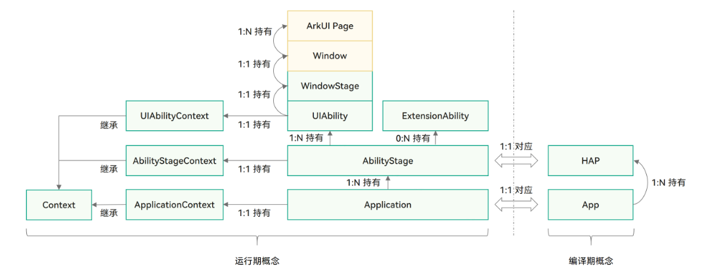
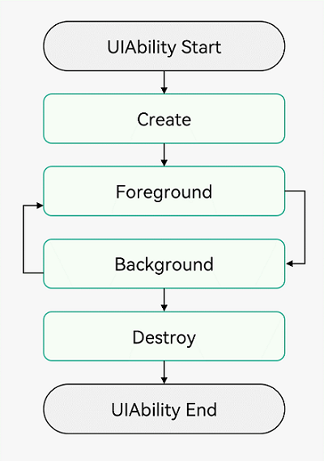
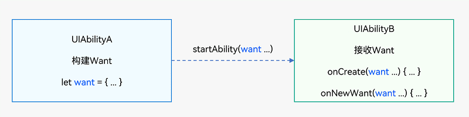
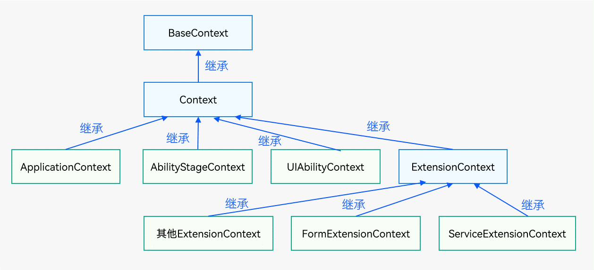
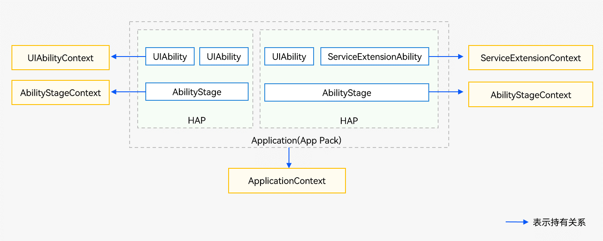
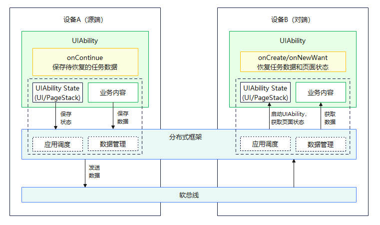
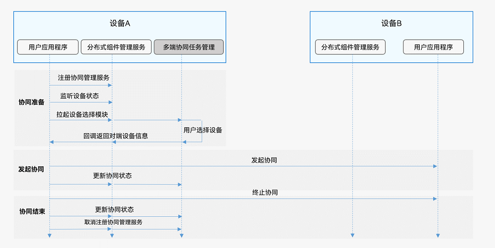

# 为什么会有Stage模型?

- 方便共享状态，减少内存使用
    
- 应用与组件解耦
    
    - 跨段迁移
    - 多端协同
- 应用组件管理和窗口管理在架构层面解耦
    
    - 扩展窗口形态
    - 多设备使用一套生命周期
- 规范
    
    - 特定场景特定组件
    - 规范后台进程管理，保障用户体验
- 最重要的就是从设计开始就解耦合，解耦合带来抽象层级变高，抽象层级变高可以实现不同底层逻辑，提升兼容性。
    

# 什么是Stage模型?



- 1个APP拥有n个HAP
- 1个HAP是由1个Ability编译的
- 1个Ability拥有1个AbilityStage上下文
- 1个Ability拥有n个UIAbility
- 1个UIAbility有1个UIAbility上下文
- 1个UIAbility有1个Window
- 1Window有n个页面

# UIAbility是什么?

- 包含UI的应用组件
- 系统调度的基本单元
- 一个应用可以包含一个或多个UIAbility组件
- 在支付应用中，可以将入口功能和收付款功能分别配置为独立的UIAbility

# 为什么有UIAbility?

- 为了原生支持应用组件级的跨端迁移和多端协同
- 为了支持多设备和多窗口形态

# 多个UIAbility如何配置?

- module.json5

```
{
  "module": {
    ...
    "abilities": [
      {
        "name": "EntryAbility", // UIAbility组件的名称
        "srcEntry": "./ets/entryability/EntryAbility.ts", // UIAbility组件的代码路径
        "description": "$string:EntryAbility_desc", // UIAbility组件的描述信息
        "icon": "$media:icon", // UIAbility组件的图标
        "label": "$string:EntryAbility_label", // UIAbility组件的标签
        "startWindowIcon": "$media:icon", // UIAbility组件启动页面图标资源文件的索引
        "startWindowBackground": "$color:start_window_background", // UIAbility组件启动页面背景颜色资源文件的索引
        ...
      }
    ]
  }
}
```

# UIAbility生命周期?



# UIAbility的启动模式是什么?

- 启动模式
    
    - singleton（单实例模式）只有一个窗口
    - multiton（多实例模式）每次都打开新窗口
    - specified（指定实例模式）自己指定怎么打开
- 指定启动模式在`module.json5`中配置
    
    ```json5
    {
    "module": {
    ...
    "abilities": [
      {
        "launchType": "singleton",
        ...
      }
    ]
    }
    }
    ```
    

# UIAbility如何和Page进行数据同步?

- 使用EventHub进行数据通信
- 使用AppStorage/LocalStorage进行数据同步

# 如何启动/停止UIAbility?

- 启动
    - `context.startAbility(want)`
    - `context.startAbilityForResult(want)`
- 停止
    - `context.terminateSelf`
    - `context.terminateSelfWithResult(data)`
- 窗口模式启动
    - `context.startAbility(want, options)`
        - `let options: StartOptions = { windowMode:AbilityConstant.WindowMode.WINDOW_MODE_FLOATING};`

# 如何启动一个UIAbility中的指定页面

- 根据参数

```ts
let want: Want = {
  deviceId: '', // deviceId为空表示本设备
  bundleName: 'com.example.funcapplication',
  moduleName: 'entry', // moduleName非必选
  abilityName: 'EntryAbility',
  parameters: { // 自定义参数传递页面信息
    router: 'funcA',
  },
}
// context为调用方UIAbility的UIAbilityContext
context.startAbility(want).then(() => {
  console.info('Succeeded in starting ability.');
})
```

- 目标UIAbility冷启动

```ts
import AbilityConstant from '@ohos.app.ability.AbilityConstant';
import UIAbility from '@ohos.app.ability.UIAbility';
import Want from '@ohos.app.ability.Want';
import window from '@ohos.window';

export default class FuncAbility extends UIAbility {
  funcAbilityWant: Want | undefined = undefined;

  onCreate(want: Want, launchParam: AbilityConstant.LaunchParam) {
    // 接收调用方UIAbility传过来的参数
    this.funcAbilityWant = want;
  }

  onWindowStageCreate(windowStage: window.WindowStage) {
    // Main window is created, set main page for this ability
    let url = 'pages/Index';
    if (this.funcAbilityWant?.parameters?.router && this.funcAbilityWant.parameters.router === 'funcA') {
      url = 'pages/Second';
    }
    windowStage.loadContent(url, (err, data) => {
      // ...
    });
  }
}
```

- 目标Ability热启动

人话: 第一次启动保留Context，后续判断是否有Context直接拉起页面

```ts
import AbilityConstant from '@ohos.app.ability.AbilityConstant';
import UIAbility from '@ohos.app.ability.UIAbility';
import Want from '@ohos.app.ability.Want';
import window from '@ohos.window';

import { UIContext } from '@ohos.arkui.UIContext';

export default class EntryAbility extends UIAbility {
  funcAbilityWant: Want | undefined = undefined;
  uiContext: UIContext | undefined = undefined;

  // ...

  onWindowStageCreate(windowStage: window.WindowStage) {
    // Main window is created, set main page for this ability
    let url = 'pages/Index';
    if (this.funcAbilityWant?.parameters?.router && this.funcAbilityWant.parameters.router === 'funcA') {
      url = 'pages/Second';
    }

    windowStage.loadContent(url, (err, data) => {
      if (err.code) {
        return;
      }

      let windowClass: window.Window;
      windowStage.getMainWindow((err, data) => {
        if (err.code) {
          console.error(`Failed to obtain the main window. Code is ${err.code}, message is ${err.message}`);
          return;
        }
        windowClass = data;
        this.uiContext = windowClass.getUIContext();
      })
    });
  }
}
```

- 通过Call调用实现UIAbility交互
- Call调用是UIAbility能力的扩展，它为UIAbility提供一种能够被外部调用并与外部进行通信的能力
- Call调用支持前台与后台两种启动方式，使UIAbility既能被拉起到前台展示UI，也可以在后台被创建并运行
- Call调用在调用方与被调用方间建立了IPC通信，因此应用开发者可通过Call调用实现不同UIAbility之间的数据共享
- 一套API
    - `tartAbilityByCall(want: Want): Promise<Caller>` 启动指定UIAbility并获取其Caller通信接口，默认为后台启动，通过配置want可实现前台启动，详见接口文档。AbilityContext与ServiceExtensionContext均支持该接口。
    - `on(method: string, callback: CalleeCallBack): void` 通用组件Callee注册method对应的callback方法。
    - `off(method: string): void` 通用组件Callee解注册method的callback方法。
    - `call(method: string, data: rpc.Parcelable): Promise<void>` 向通用组件Callee发送约定序列化数据。
    - `callWithResult(method: string, data: rpc.Parcelable): Promise<rpc.MessageSequence>` 向通用组件Callee发送约定序列化数据, 并将Callee返回的约定序列化数据带回。
    - `release(): void` 释放通用组件的Caller通信接口。 on(type: “release”, callback: OnReleaseCallback): void 注册通用组件通信断开监听通知。

# 什么是Want?

- Want是一种对象，用于在应用组件之间传递信息。



```ts
let want: Want = {
  deviceId: '', // deviceId为空表示本设备
  bundleName: 'com.example.myapplication',
  moduleName: 'func', // moduleName非必选
  abilityName: 'FuncAbility',
  parameters: { // 自定义信息
    info: '来自EntryAbility Index页面',
  },
}
```

# Want有几种类型 ?

- 显式Want: 直接指定哪个应用
- 隐式Want: 用于比如通过xxx应用打开

# ExtensionAbility 是什么?

- 插件Ability
- 在自己单独的进程中运行
- 每一个具体场景对应一个ExtensionAbilityType，开发者只能使用（包括实现和访问）系统已定义的类型
- FormExtensionAbility: FORM类型,用于提供服务卡片的相关能力
- WorkSchedulerExtensionAbility: WORK\_SCHEDULER类型的ExtensionAbility组件，用于提供延迟任务的相关能力
- InputMethodExtensionAbility: INPUT\_METHOD类型的ExtensionAbility组件，用于实现输入法应用的开发
- AccessibilityExtensionAbility: ACCESSIBILITY类型的ExtensionAbility组件，用于实现无障碍扩展服务的开发
- ServiceExtensionAbility: SERVICE类型的ExtensionAbility组件，为系统应用提供后台服务的相关能力。如果三方开发者想要实现后台处理事务的功能，可以使用后台任务
- DataShareExtensionAbility: DATA\_SHARE类型的ExtensionAbility组件，用于提供数据共享的相关能力
- StaticSubscriberExtensionAbility: STATIC\_SUBSCRIBER类型的ExtensionAbility组件，用于提供静态订阅公共事件的相关能力
- BackupExtensionAbility: BACKUP类型的ExtensionAbility组件，用于提供备份及恢复应用数据的能力
- WindowExtensionAbility: WINDOW类型的ExtensionAbility组件，为系统应用提供界面组合扩展的相关能力，允许系统应用进行跨应用的界面拉起和嵌入
- EnterpriseAdminExtensionAbility: ENTERPRISE\_ADMIN类型的ExtensionAbility组件，用于提供企业设备事件管理的相关能力，比如设备上应用安装事件、锁屏密码输入错误次数过多事件等
- DriverExtensionAbility: DRIVER类型的ExtensionAbility组件，用于提供驱动相关扩展框架

# AbilityStage是什么?

- AbilityStage是一个Module级别的组件容器，应用的HAP在首次加载时会创建一个AbilityStage实例，可以对该Module进行初始化等操作
- AbilityStage与Module一一对应，即一个Module拥有一个AbilityStage
- AbilityStage拥有`onCreate()`生命周期回调和`onAcceptWant()`、`onConfigurationUpdated()`、`onMemoryLevel()`事件回调。
    - `onCreate`在开始加载对应Module的第一个UIAbility实例之前会先创建AbilityStage，并在AbilityStage创建完成之后执行其onCreate()生命周期回调
    - onAcceptWant()事件回调：UIAbility指定实例模式（specified）启动时候触发的事件回调
    - onConfigurationUpdated()事件回调：当系统全局配置发生变更时触发的事件，系统语言、深浅色等，配置项目前均定义在Configuration类中
    - onMemoryLevel()事件回调：当系统调整内存时触发的事件

```ts
import AbilityStage from '@ohos.app.ability.AbilityStage';
import Want from '@ohos.app.ability.Want';

export default class MyAbilityStage extends AbilityStage {
  onCreate() {
    // 应用的HAP在首次加载的时，为该Module初始化操作
  }
  onAcceptWant(want: Want) {
    // 仅specified模式下触发
    return "MyAbilityStage";
  }
}
```

```json5
{
  "module": {
    "name": "entry",
    "type": "entry",
    "srcEntry": "./ets/myabilitystage/MyAbilityStage.ets",
    ...
  }
}
```

# 什么是Context?

- 上下文/域
- 上下文有多种类型多种级别





# 可以实现应用跨设备拖拽移动吗？

- 可以
- 支持
    - 流转
    - 跨端迁移
    - 多端协同

# 跨端迁移如何实现?



- 在module.json5配置文件的abilities标签中配置跨端迁移标签continuable

```json5
{
  "module": {
    // ...
    "abilities": [
      {
        // ...
        "continuable": true, // 配置UIAbility支持迁移
      }
    ]
  }
}
```

- 在源端UIAbility中实现onContinue()回调

```ts
import AbilityConstant from '@ohos.app.ability.AbilityConstant';
import hilog from '@ohos.hilog';
import UIAbility from '@ohos.app.ability.UIAbility';

const TAG: string = '[MigrationAbility]';
const DOMAIN_NUMBER: number = 0xFF00;

export default class MigrationAbility extends UIAbility {
  onContinue(wantParam: Record<string, Object>):AbilityConstant.OnContinueResult {
    let version = wantParam.version;
    let targetDevice = wantParam.targetDevice;
    hilog.info(DOMAIN_NUMBER, TAG, `onContinue version = ${version}, targetDevice: ${targetDevice}`); // 准备迁移数据

    // 获取源端版本号
    let versionSrc: number = -1; // 请填充具体获取版本号的代码

    // 兼容性校验
    if (version !== versionSrc) {
      // 在兼容性校验不通过时返回MISMATCH
      return AbilityConstant.OnContinueResult.MISMATCH;
    }

    // 将要迁移的数据保存在wantParam的自定义字段（例如data）中
    const continueInput = '迁移的数据';
    wantParam['data'] = continueInput;

    return AbilityConstant.OnContinueResult.AGREE;
  }
}
```

- 源端设备UIAbility实例在冷启动和热启动情况下分别会调用不同的接口来恢复数据和加载UI

```ts
import AbilityConstant from '@ohos.app.ability.AbilityConstant';
import hilog from '@ohos.hilog';
import UIAbility from '@ohos.app.ability.UIAbility';
import type Want from '@ohos.app.ability.Want';

const TAG: string = '[MigrationAbility]';
const DOMAIN_NUMBER: number = 0xFF00;

export default class MigrationAbility extends UIAbility {
  storage : LocalStorage = new LocalStorage();

  onCreate(want: Want, launchParam: AbilityConstant.LaunchParam): void {
    hilog.info(DOMAIN_NUMBER, TAG, '%{public}s', 'Ability onCreate');
    if (launchParam.launchReason === AbilityConstant.LaunchReason.CONTINUATION) {
      // 将上述保存的数据从want.parameters中取出恢复
      let continueInput = '';
      if (want.parameters !== undefined) {
        continueInput = JSON.stringify(want.parameters.data);
        hilog.info(DOMAIN_NUMBER, TAG, `continue input ${continueInput}`);
      }
      // 触发页面恢复
      this.context.restoreWindowStage(this.storage);
    }
  }

  onNewWant(want: Want, launchParam: AbilityConstant.LaunchParam): void {
     hilog.info(DOMAIN_NUMBER, TAG, 'onNewWant');
     if (launchParam.launchReason === AbilityConstant.LaunchReason.CONTINUATION) {
       // 将上述保存的数据从want.parameters中取出恢复
       let continueInput = '';
       if (want.parameters !== undefined) {
         continueInput = JSON.stringify(want.parameters.data);
         hilog.info(DOMAIN_NUMBER, TAG, `continue input ${continueInput}`);
       }
       // 触发页面恢复  
       this.context.restoreWindowStage(this.storage);
     }
   }
}
```

其实就是状态保存和状态恢复就可以了

# 如何实现多端协同?

- 通过跨设备启动UIAbility和ServiceExtensionAbility组件实现多端协同（无返回数据）
- 通过跨设备启动UIAbility组件实现多端协同（获取返回数据）
- 通过跨设备连接ServiceExtensionAbility组件实现多端协同
- 通过跨设备Call调用实现多端协同



[https://docs.openharmony.cn/pages/v4.0/zh-cn/application-dev/application-models/hop-multi-device-collaboration.md](https://docs.openharmony.cn/pages/v4.0/zh-cn/application-dev/application-models/hop-multi-device-collaboration.md)

# 系统环境变量是什么？

- 系统环境变量是指：在应用程序运行期间，终端设备的系统设置（例如系统的语言环境、屏幕方向等）发生变化
    
- 基于当前的应用模型，可以通过以下几种方式来实现订阅系统环境变量的变化
    
    - 使用ApplicationContext订阅回调
        - `applicationContext.on('environment', environmentCallback);`
        - `applicationContext.off('environment', this.callbackId);`
    - 在AbilityStage组件容器中订阅回调
        - 继承`export default class MyAbilityStage extends AbilityStage`
        - 重载接口`onConfigurationUpdate`
    - 在UIAbility组件中订阅回调
        - 直接搞`onConfigurationUpdate`
    - 在ExtensionAbility组件中订阅回调
        - 直接搞`onConfigurationUpdate`
