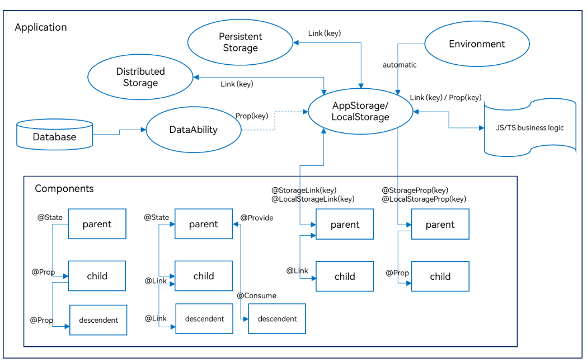

# 状态管理

# 分类

- 装饰器可以大致分为
    - 组件级别的状态管理
    - 应用级别的状态管理
- 数据的传递形式和同步类型层面
    - 只读-单向
    - 可变-双向

# 总图

# 组件状态

- 管理组件拥有的状态
    - @State
        - 状态变量
        - 渲染绑定
        - 不与父组件中任何类型的变量同步
        - 父组件初始化时常规变量不触发页面刷新只有状态变量才能触发UI刷新
        - 支持初始化子组件的常规变量@State、@Link、`@Prop`、@Provide
    - @Prop
        - 父子单向同步
        - @Prop装饰变量时会进行深拷贝，在拷贝的过程中除了基本类型、Map、Set、Date、Array外，都会丢失类型
        - @Prop装饰器不能在@Entry装饰的自定义组件中使用
        - 在组件复用场景，建议@Prop深度嵌套数据不要超过5层，嵌套太多会导致深拷贝占用的空间过大以及GarbageCollection(垃圾回收)，引起性能问题，此时更建议使用@ObjectLink
    - @Link
        - 父子双向同步
        - 与父组件@State, @StorageLink和@Link 建立双向绑定。允许父组件中@State、@Link、@Prop、@Provide、@Consume、@ObjectLink、@StorageLink、@StorageProp、@LocalStorageLink和@LocalStorageProp装饰变量初始化子组件@Link
    - @Provide
        - @Provide和@Consume，应用于与后代组件的双向数据同步
        - 摆脱参数传递机制的束缚，实现跨层级传递
        - 双向同步
        - 从@Provide变量到所有@Consume变量以及相反的方向的数据同步。双向同步的操作与@State和@Link的组合相同
    - @Observed,@ObjectLink
        - 嵌套类对象属性变化
        - 不与父组件中的任何类型同步变量
        - 双向同步

# 应用状态

- 管理应用状态
    - 内存
        - AppStorage 应用全局的UI状态存储
            - @StorageProp
            - @StorageLink
        - LocalStorage 页面级UI状态存储
            - @LocalStorageProp
            - @LocalStorageLink
    - 持久化
        - PersistentStorage

# 其他状态

- 其他
    - @Watch用于监听状态变量的变化
    - $$运算符：给内置组件提供TS变量的引用，使得TS变量和内置组件的内部状态保持同步。
