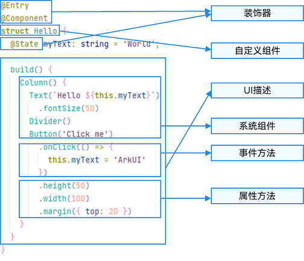
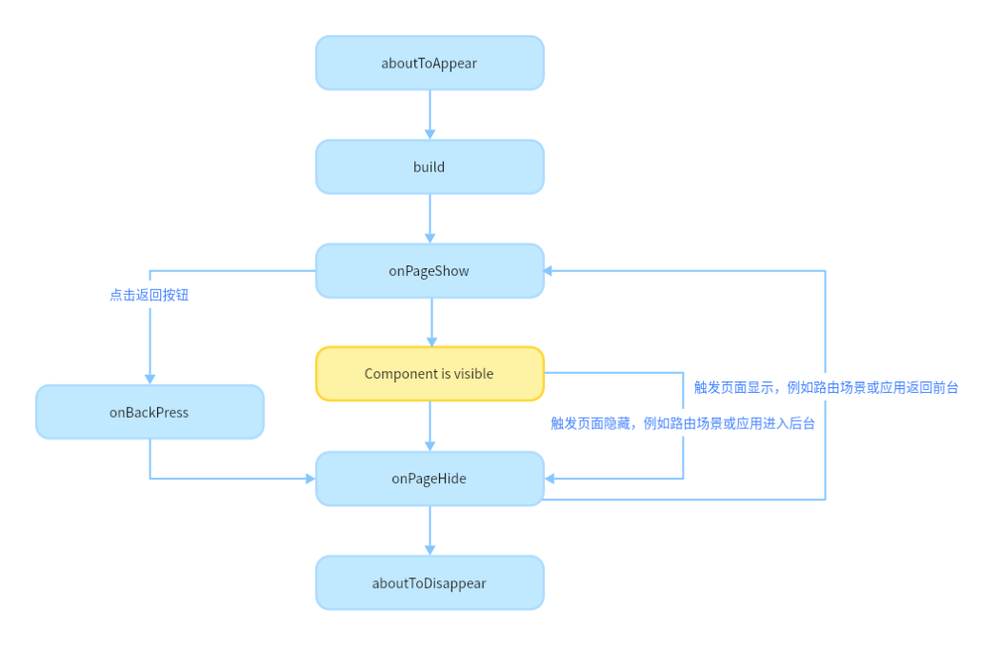

# 语法



# 自定义组件

```ts
@Component
struct MyComponent {
  private countDownFrom: number = 0;
  private color: Color = Color.Blue;

  build() {
  }
}

@Entry
@Component
struct ParentComponent {
  private someColor: Color = Color.Pink;

  build() {
    Column() {
      // 创建MyComponent实例，并将创建MyComponent成员变量countDownFrom初始化为10，将成员变量color初始化为this.someColor
      MyComponent({ countDownFrom: 10, color: this.someColor })
    }
  }
}
```

- `@Entry`@Entry装饰的自定义组件将作为UI页面的入口
- `@Component`声明为组件,必须实现`build`函数

# 生命周期

- 页面生命周期
    - `onPageShow`：页面每次显示时触发一次，包括路由过程、应用进入前台等场景。
    - `onPageHide`：页面每次隐藏时触发一次，包括路由过程、应用进入后台等场景。
    - `onBackPress`：当用户点击返回按钮时触发。
- 组件生命周期
    - `aboutToAppear`：组件即将出现时回调该接口，具体时机为在创建自定义组件的新实例后，在执行其build()函数之前执行。
    - `aboutToDisappear`：aboutToDisappear函数在自定义组件析构销毁之前执行。不允许在aboutToDisappear函数中改变状态变量，特别是@Link变量的修改可能会导致应用程序行为不稳定。



# @Builder

@Builder其实就是函数作为组件

```ts
class Tmp {
  paramA1: string = ''
}
---
@Builder function overBuilder(params: Tmp) {
  Row() {
    Text(`UseStateVarByReference: ${params.paramA1} `)
  }
}
---
@Entry
@Component
struct Parent {
  @State label: string = 'Hello';
  build() {
    Column() {
      // 在Parent组件中调用overBuilder的时候，将this.label引用传递给overBuilder
      overBuilder({ paramA1: this.label })
      Button('Click me').onClick(() => {
        // 点击“Click me”后，UI从“Hello”刷新为“ArkUI”
        this.label = 'ArkUI';
      })
    }
  }
}
```

# @BuilderParam

@BuilderParam其实就是把@Builder作为参数

```ts
@Builder function overBuilder() {}
---
@Component
struct Child {
  @Builder doNothingBuilder() {};

  // 使用自定义组件的自定义构建函数初始化@BuilderParam
  @BuilderParam customBuilderParam: () => void = this.doNothingBuilder;
  // 使用全局自定义构建函数初始化@BuilderParam
  @BuilderParam customOverBuilderParam: () => void = overBuilder;
  build(){}
}
```

```ts
@Component
struct Child {
  @Builder customBuilder() {}
  // 使用父组件@Builder装饰的方法初始化子组件@BuilderParam
  @BuilderParam customBuilderParam: () => void = this.customBuilder;

  build() {
    Column() {
      this.customBuilderParam()
    }
  }
}
---
@Entry
@Component
struct Parent {
  @Builder componentBuilder() {
    Text(`Parent builder `)
  }

  build() {
    Column() {
      Child({ customBuilderParam: this.componentBuilder })
    }
  }
}
```

- 闭包

```
// xxx.ets
@Component
struct CustomContainer {
  @Prop header: string = '';
  @Builder closerBuilder(){}
  // 使用父组件的尾随闭包{}(@Builder装饰的方法)初始化子组件@BuilderParam
  @BuilderParam closer: () => void = this.closerBuilder

  build() {
    Column() {
      Text(this.header)
        .fontSize(30)
      this.closer()
    }
  }
}

@Builder function specificParam(label1: string, label2: string) {
  Column() {
    Text(label1)
      .fontSize(30)
    Text(label2)
      .fontSize(30)
  }
}

@Entry
@Component
struct CustomContainerUser {
  @State text: string = 'header';

  build() {
    Column() {
      // 创建CustomContainer，在创建CustomContainer时，通过其后紧跟一个大括号“{}”形成尾随闭包
      // 作为传递给子组件CustomContainer @BuilderParam closer: () => void的参数
      CustomContainer({ header: this.text }) {
        Column() {
          specificParam('testA', 'testB')
        }.backgroundColor(Color.Yellow)
        .onClick(() => {
          this.text = 'changeHeader';
        })
      }
    }
  }
}
```

# @Styles

抽出共有样式

```ts
// 定义在全局的@Styles封装的样式
@Styles function globalFancy  () {
  .width(150)
  .height(100)
  .backgroundColor(Color.Pink)
}

@Entry
@Component
struct FancyUse {
  @State heightValue: number = 100
  // 定义在组件内的@Styles封装的样式
  @Styles fancy() {
    .width(200)
    .height(this.heightValue)
    .backgroundColor(Color.Yellow)
    .onClick(() => {
      this.heightValue = 200
    })
  }

  build() {
    Column({ space: 10 }) {
      // 使用全局的@Styles封装的样式
      Text('FancyA')
        .globalFancy()
        .fontSize(30)
      // 使用组件内的@Styles封装的样式
      Text('FancyB')
        .fancy()
        .fontSize(30)
    }
  }
}
```

# @Extend

也是共用样式的一种方式

```ts
@Extend(Text) function fancyText(weightValue: number, color: Color) {
  .fontStyle(FontStyle.Italic)
  .fontWeight(weightValue)
  .backgroundColor(color)
}

@Entry
@Component
struct FancyUse {
  @State label: string = 'Hello World'

  build() {
    Row({ space: 10 }) {
      Text(`${this.label}`)
        .fancyText(100, Color.Blue)
      Text(`${this.label}`)
        .fancyText(200, Color.Pink)
      Text(`${this.label}`)
        .fancyText(300, Color.Orange)
    }.margin('20%')
  }
}
```

# stateStyles

根据组件的状态渲染不同的样式

```ts
@Entry
@Component
struct MyComponent {
  @Styles normalStyle() {
    .backgroundColor(Color.Gray)
  }

  @Styles pressedStyle() {
    .backgroundColor(Color.Red)
  }

  build() {
    Column() {
      Text('Text1')
        .fontSize(50)
        .fontColor(Color.White)
        .stateStyles({
          normal: this.normalStyle,
          pressed: this.pressedStyle,
        })
    }
  }
}
```

# @AnimatableExtend

定义动画

```ts
@AnimatableExtend(Text) function animatableFontSize(size: number) {
  .fontSize(size)
}

@Entry
@Component
struct AnimatablePropertyExample {
  @State fontSize: number = 20
  build() {
    Column() {
      Text("AnimatableProperty")
        .animatableFontSize(this.fontSize)
        .animation({duration: 1000, curve: "ease"})
      Button("Play")
        .onClick(() => {
          this.fontSize = this.fontSize == 20 ? 36 : 20
        })
    }.width("100%")
    .padding(10)
  }
}

---

class Point {
  x: number
  y: number

  constructor(x: number, y: number) {
    this.x = x
    this.y = y
  }
  plus(rhs: Point): Point {
    return new Point(this.x + rhs.x, this.y + rhs.y)
  }
  subtract(rhs: Point): Point {
    return new Point(this.x - rhs.x, this.y - rhs.y)
  }
  multiply(scale: number): Point {
    return new Point(this.x * scale, this.y * scale)
  }
  equals(rhs: Point): boolean {
    return this.x === rhs.x && this.y === rhs.y
  }
}

class PointVector extends Array<Point> implements AnimatableArithmetic<PointVector> {
  constructor(value: Array<Point>) {
    super();
    value.forEach(p => this.push(p))
  }
  plus(rhs: PointVector): PointVector {
    let result = new PointVector([])
    const len = Math.min(this.length, rhs.length)
    for (let i = 0; i < len; i++) {
      result.push((this as Array<Point>)[i].plus((rhs as Array<Point>)[i]))
    }
    return result
  }
  subtract(rhs: PointVector): PointVector {
    let result = new PointVector([])
    const len = Math.min(this.length, rhs.length)
    for (let i = 0; i < len; i++) {
      result.push((this as Array<Point>)[i].subtract((rhs as Array<Point>)[i]))
    }
    return result
  }
  multiply(scale: number): PointVector {
    let result = new PointVector([])
    for (let i = 0; i < this.length; i++) {
      result.push((this as Array<Point>)[i].multiply(scale))
    }
    return result
  }
  equals(rhs: PointVector): boolean {
    if (this.length != rhs.length) {
      return false
    }
    for (let i = 0; i < this.length; i++) {
      if (!(this as Array<Point>)[i].equals((rhs as Array<Point>)[i])) {
        return false
      }
    }
    return true
  }
  get(): Array<Object[]> {
    let result: Array<Object[]> = []
    this.forEach(p => result.push([p.x, p.y]))
    return result
  }
}

@AnimatableExtend(Polyline) function animatablePoints(points: PointVector) {
  .points(points.get())
}
---
@Entry
@Component
struct AnimatablePropertyExample {
  @State points: PointVector = new PointVector([
    new Point(50, Math.random() * 200),
    new Point(100, Math.random() * 200),
    new Point(150, Math.random() * 200),
    new Point(200, Math.random() * 200),
    new Point(250, Math.random() * 200),
  ])
  build() {
    Column() {
      Polyline()
        .animatablePoints(this.points)
        .animation({duration: 1000, curve: "ease"})
        .size({height:220, width:300})
        .fill(Color.Green)
        .stroke(Color.Red)
        .backgroundColor('#eeaacc')
      Button("Play")
        .onClick(() => {
          this.points = new PointVector([
            new Point(50, Math.random() * 200),
            new Point(100, Math.random() * 200),
            new Point(150, Math.random() * 200),
            new Point(200, Math.random() * 200),
            new Point(250, Math.random() * 200),
          ])
        })
    }.width("100%")
    .padding(10)
  }
}
```
