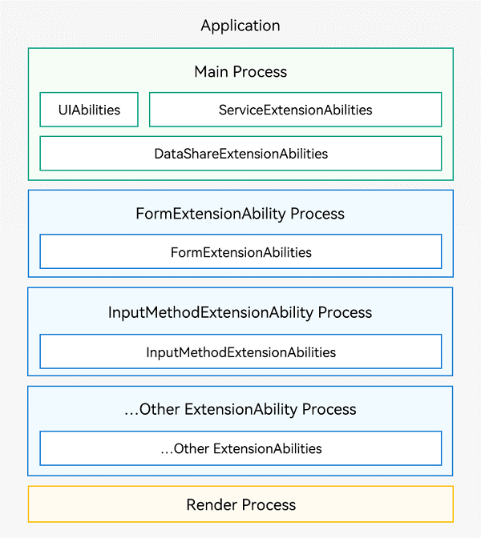
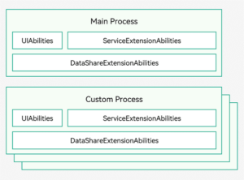
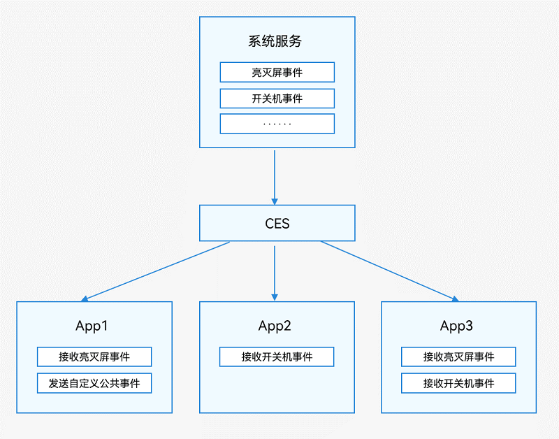
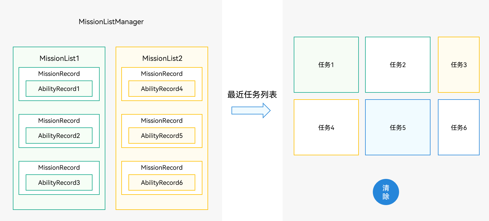
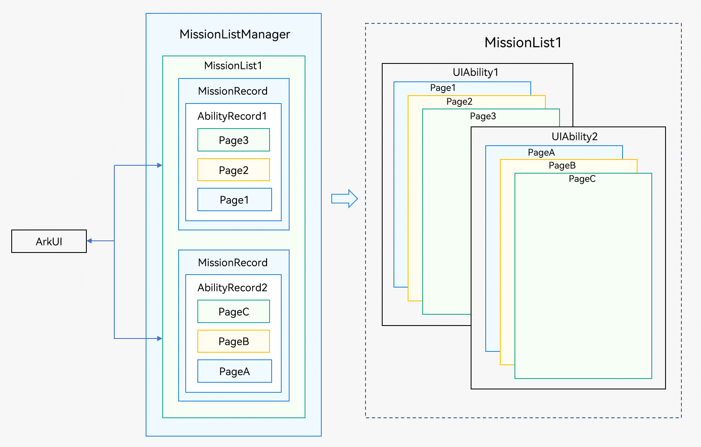

# 进程

- 进程模型示意图



- 应用中`（同一Bundle名称）`的`所有UIAbility`、ServiceExtensionAbility和DataShareExtensionAbility`均是运行在同一个独立进程（主进程）中`
    
- 应用中`（同一Bundle名称`）的`所有同一类型ExtensionAbility`（除ServiceExtensionAbility和DataShareExtensionAbility外）`均是运行在一个独立进程中`
    
- `WebView`拥有`独立的渲染进程`
    
- 多进程示意图
    



- 因为有多个进程，进程之间需要通信
    - 公共事件机制：多用于一对多的通信场景
    - 后台服务机制：通过ServiceExtensionAbility的能力实现

# 公共事件

- CES（Common Event Service，公共事件服务）为应用程序提供订阅、发布、退订公共事件的能力
    
- 从系统角度分类
    
    - 系统公共事件
    - 自定义公共事件
- 按发送方式分类
    
    - 无序公共事件
        - 不考虑订阅者是否接收到该事件，也不保证订阅者接收到该事件的顺序与其订阅顺序一致
    - 有序公共事件
        - 根据订阅者设置的优先级等级，优先将公共事件发送给优先级较高的订阅者，等待其成功接收该公共事件之后再将事件发送给优先级较低的订阅者
        - 如果有多个订阅者具有相同的优先级，则他们将随机接收到公共事件
    - 粘性公共事件
        - 能够让订阅者收到在订阅前已经发送的公共事件
        - 粘性事件发送后会一直存在系统中，且发送者需要申请ohos.permission.COMMONEVENT\_STICKY权限



- 订阅方式
    - 动态
        - 运行时调用公共事件订阅的API实现对公共事件的订阅
        - `createSubscriber(subscribeInfo: CommonEventSubscribeInfo, callback: AsyncCallback<CommonEventSubscriber>): void`
        - `createSubscriber(subscribeInfo: CommonEventSubscribeInfo): Promise<CommonEventSubscriber>`
        - `subscribe(subscriber: CommonEventSubscriber, callback: AsyncCallback): void`
    - 静态
        - 配置文件声明和实现继承StaticSubscriberExtensionAbility的类实现对公共事件的订阅

```ts
静态
import StaticSubscriberExtensionAbility from '@ohos.application.StaticSubscriberExtensionAbility';
import commonEventManager from '@ohos.commonEventManager';

export default class StaticSubscriber extends StaticSubscriberExtensionAbility {
  onReceiveEvent(event: commonEventManager.CommonEventData) {
    console.info('onReceiveEvent, event: ' + event.event);
  }
}
```

```json5
{
  "module": {
    "extensionAbilities": [
      {
        "name": "StaticSubscriber",
        "srcEntry": "./ets/staticsubscriber/StaticSubscriber.ts",
        "description": "$string:StaticSubscriber_desc",
        "icon": "$media:icon",
        "label": "$string:StaticSubscriber_label",
        "type": "staticSubscriber",
        "exported": true,
        "metadata": [
          {
            "name": "ohos.extension.staticSubscriber",
            "resource": "$profile:subscribe"
          }
        ]
      }
    ]
  }
}
```

- 取消订阅
    
    - `unsubscribe(subscriber: CommonEventSubscriber, callback?: AsyncCallback)`
- 公共事件发布
    
    - `publish(event: string, callback: AsyncCallback)`
    - `publish(event: string, options: CommonEventPublishData, callback: AsyncCallback)`
- 移除粘性公共事件
    
    - `removeStickyCommonEvent(event: string, callback: AsyncCallback<void>): void`
- 后台服务
    
    - Stage模型通过提供ServiceExtensionAbility，支持系统应用实现一个后台服务并对外提供相应的能力；系统应用A实现了一个后台服务，三方应用B可以通过连接系统应用A的后台服务与其进行进程间通信。

# 线程

- 三类
    - 主线程
        - 执行UI绘制。
        - 管理主线程的ArkTS引擎实例，使多个UIAbility组件能够运行在其之上
        - 管理其他线程的ArkTS引擎实例，例如使用TaskPool（任务池）创建任务或取消任务、启动和终止Worker线程
        - 分发交互事件。
        - 处理应用代码的回调，包括事件处理和生命周期管理
        - 接收TaskPool以及Worker线程发送的消息
    - TaskPool Worker线程
        - 用于执行耗时操作，支持设置调度优先级、负载均衡等功能，推荐使用
    - Worker线程
        - 用于执行耗时操作，支持线程间通信。 TaskPool与Worker的运作机制、通信手段和使用方法可以参考TaskPool和Worker的对比

# 任务管理

- MissionListManager
    - 系统任务管理模块，内部维护了当前所有的任务链，与最近任务列表保持一致
- MissionList
    - 任务链
- MissionRecord
    - 任务管理的最小单元
- AbilityRecord
    - 系统服务侧管理一个UIAbility实例的最小单元，对应一个应用侧的UIAbility组件实例




