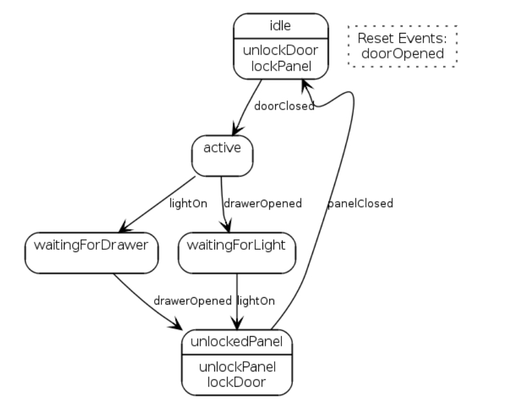
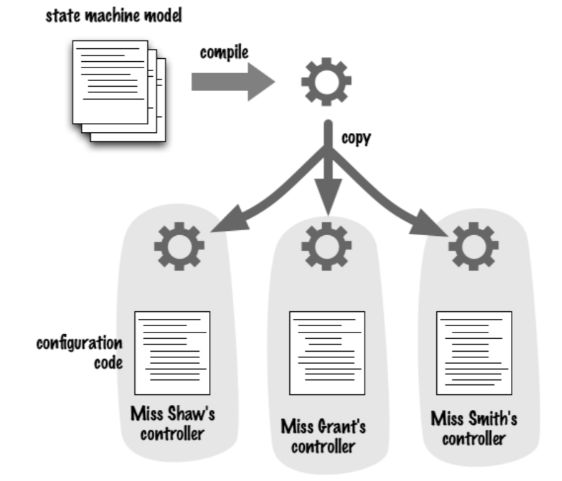
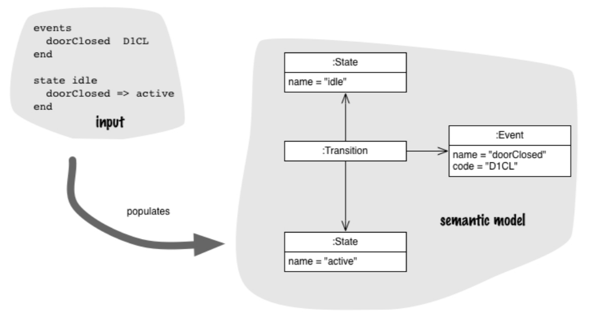
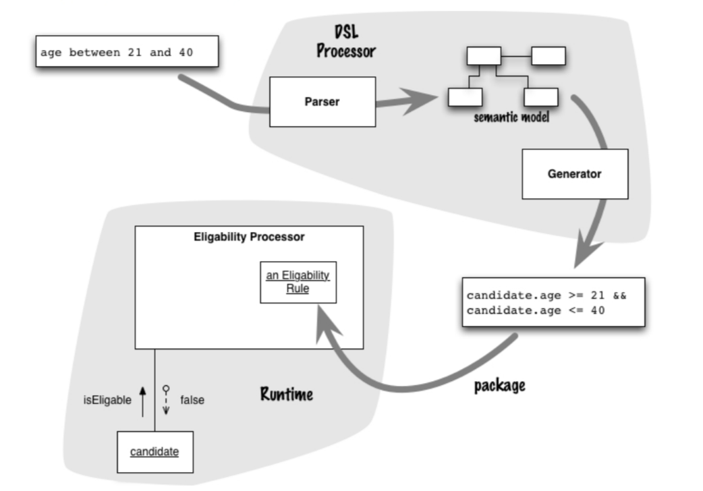

# 1\. Basic Example

- Imagine a program: A room full of secret passages and mechanisms as the background.
    - Miss Grant closes her bedroom door, opens a drawer, and turns on a light to access a secret compartment.
    - Miss Shaw turns on a tap, then opens either of her two compartments by turning on the correct light.
    - Miss Smith has a secret compartment inside a locked closet inside her office. She has to close a door, take a picture off the wall, turn her desk light on three times, open the top drawer of her filing cabinet—and then the closet is unlocked. If she forgets to turn the desk light off before she opens the inner compartment, an alarm will sound.

## 1.1 State diagram for Miss Grant's secret compartment



- In idle state, the door is unlocked and the panel is locked.
- When the door is closed, it enters a listening state.
    - Wait for the drawer to open when the light is on.
    - Wait for the light to turn on when the drawer is opened.
- When the lamp status and drawer status are all ready, open the panel. At this time, the panel is open and the door is locked.
- When the panel is closed, it returns to its initial state.

## 1.2 Class diagram of the state machine framework


- We need a central controller.
- The controller communicates with various mechanisms (sensors).
- The communication content is a random string of four characters.

> For the implementation of the class diagram, please refer to the sixth page of Domain Specific Language. The following is the code that is directly used to implement it.

```java
Event doorClosed = new Event("doorClosed", "D1CL");
Event drawerOpened = new Event("drawerOpened", "D2OP");
Event lightOn = new Event("lightOn", "L1ON");
Event doorOpened = new Event("doorOpened", "D1OP");
Event panelClosed = new Event("panelClosed", "PNCL");
Command unlockPanelCmd = new Command("unlockPanel", "PNUL");
Command lockPanelCmd = new Command("lockPanel", "PNLK");
Command lockDoorCmd = new Command("lockDoor", "D1LK");
Command unlockDoorCmd = new Command("unlockDoor", "D1UL");
State idle = new State("idle");
State activeState = new State("active");
State waitingForLightState = new State("waitingForLight");
State waitingForDrawerState = new State("waitingForDrawer");
State unlockedPanelState = new State("unlockedPanel");
StateMachine machine = new StateMachine(idle);
idle.addTransition(doorClosed, activeState);
idle.addAction(unlockDoorCmd);
idle.addAction(lockPanelCmd);
activeState.addTransition(drawerOpened, waitingForLightState);
activeState.addTransition(lightOn, waitingForDrawerState);
waitingForLightState.addTransition(lightOn, unlockedPanelState);
waitingForDrawerState.addTransition(drawerOpened, unlockedPanelState);
unlockedPanelState.addAction(unlockPanelCmd);
unlockedPanelState.addAction(lockDoorCmd);
unlockedPanelState.addTransition(panelClosed, idle);
machine.addResetEvents(doorOpened);
```

- The first half is how to define the model of the controller.
- The second half is how to configure the business we want based on the model.

## 1.3 A single library used with multiple configurations



- After we have the model, we can abstract the model and implement our business through different external configurations instead of writing them together.
- We achieve 3 different needs through different configurations and the same model.

> Question: Do we need to recompile every time we change the configuration ? Answer: Models can be configured and run via external configuration mode

- Here is another way of representing that configuration code

```xml
<stateMachine start = "idle">
 <event name="doorClosed" code="D1CL"/>
 <event name="drawerOpened" code="D2OP"/>
 <event name="lightOn" code="L1ON"/>
 <event name="doorOpened" code="D1OP"/>
 <event name="panelClosed" code="PNCL"/>

 <command name="unlockPanel" code="PNUL"/>
 <command name="lockPanel" code="PNLK"/>
 <command name="lockDoor" code="D1LK"/>
 <command name="unlockDoor" code="D1UL"/>
 <state name="idle">
 <transition event="doorClosed" target="active"/>
 <action command="unlockDoor"/>
 <action command="lockPanel"/>
 </state>
 <state name="active">
 <transition event="drawerOpened" target="waitingForLight"/>
 <transition event="lightOn" target="waitingForDrawer"/>
 </state>
 <state name="waitingForLight">
 <transition event="lightOn" target="unlockedPanel"/>
 </state>
 <state name="waitingForDrawer">
 <transition event="drawerOpened" target="unlockedPanel"/>
 </state>
 <state name="unlockedPanel">
 <action command="unlockPanel"/>
 <action command="lockDoor"/> 
 <transition event="panelClosed" target="idle"/>
 </state>
 <resetEvent name = "doorOpened"/>
</stateMachine>
```

- Here's another version of the configuration code:

```
events
 doorClosed D1CL
 drawerOpened D2OP
 lightOn L1ON
 doorOpened D1OP
 panelClosed PNCL
end
resetEvents
 doorOpened
end
commands
 unlockPanel PNUL
 lockPanel PNLK
 lockDoor D1LK
 unlockDoor D1UL
end
state idle
 actions {unlockDoor lockPanel}
 doorClosed => active
end
state active
 drawerOpened => waitingForLight
 lightOn => waitingForDrawer
end
state waitingForLight
 lightOn => unlockedPanel
end
state waitingForDrawer
 drawerOpened => unlockedPanel
end
state unlockedPanel
 actions {unlockPanel lockDoor}
 panelClosed => idle
end
```

- This is also a code.
- It's a syntax that's easier to write and, above all, easier to read than the XML syntax.
- This language is a domain-specific language that shares many of the characteristics of DSLs.

## 1.4 Languages and Semantic Model

- The existence of state machine models and their relationship to DSL is a crucial issue.

In this example, the role of the DSL is to populate the state machine model. So, when I'm parsing the custom syntax version and come across:

```
// A new event object will be created and stored in the symbol table. (new Event("doorClosed", "D1CL"))
events.
 doorClosed D1CL
```

```
// include it in the transition (using addTransition).
doorClosed => active
```

### 1.4.1 Parsing a DSL populates a Semantic Model



- From the DSL's point of view, I refer to this model as the Semantic Model.
- The syntax captures the legal expressions of the program—everything that in the custom-syntax DSL is captured by the grammar.
- The semantics of a program is what it means—that is, what it does when it executes. In this case, it is the model that defines the semantics.
- The Semantic Model is a vital part of a well-designed DSL.

> My understanding: A grammar that can intuitively see how the model does things is semantics.

## 1.5 Code Generation

- In the previous discussion, we used DSL to fill and execute the semantic model, a method known in linguistics as interpretation.
- In the language world, the alternative to interpretation is compilation. With compilation, we parse some program text and produce an intermediate output, which is then separately processed to provide the behavior we desire. In the context of DSLs, the compilation approach is usually referred to as code generation.



- As illustrated, we first input a set of filtering rules concerning age. These rules are parsed into a semantic model by the DSL Processor, and the semantic model generates intermediate code. The intermediate code is then executed within our interpreter (or other environments) in our idiom.
    
- Code generation is often awkward in that it often pushes you to do an extra compilation step. To build your program, you have to first compile the state framework and the parser, then run the parser to generate the source code for Miss Grant's controller, then compile that generated code. This makes your build process much more complicated.
