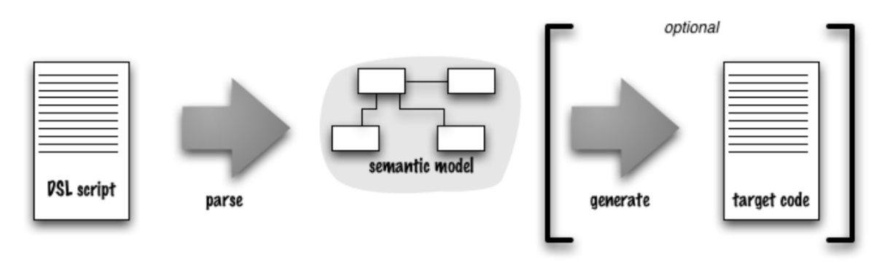
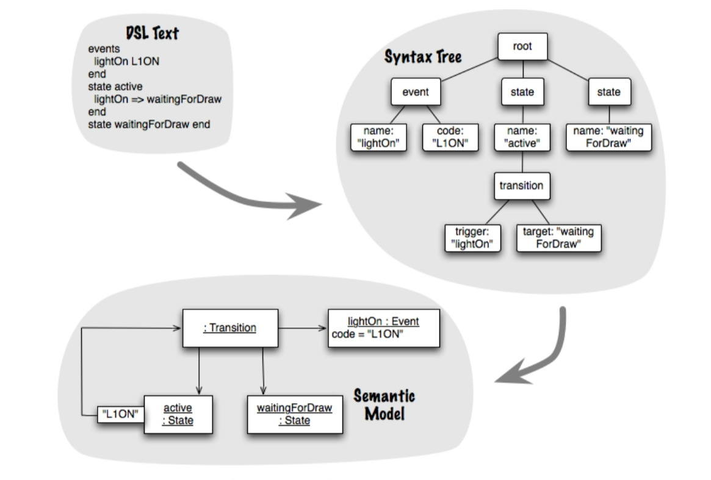
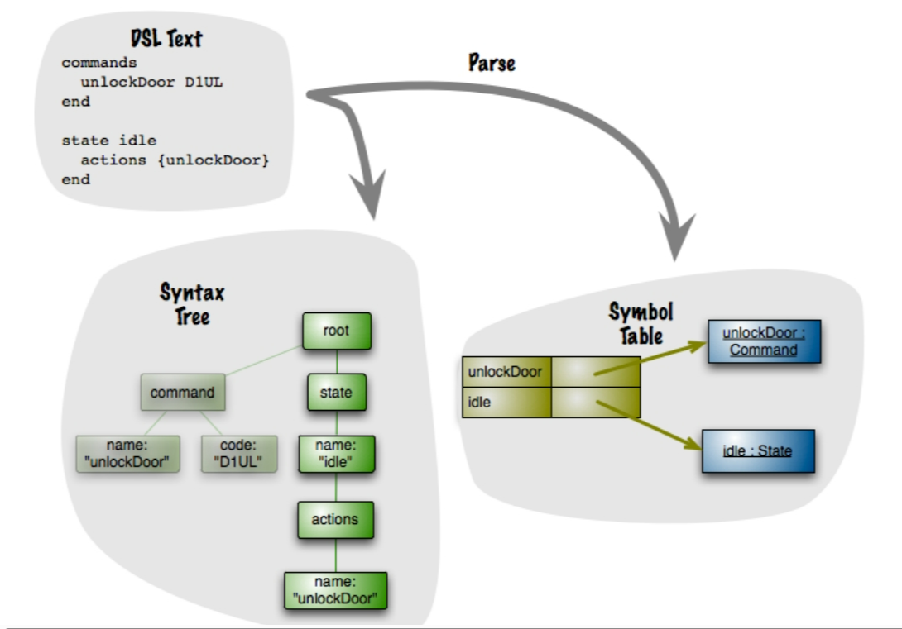

# Implementing DSL

- The implementation mentioned here is not a real implementation, it is just to briefly explain the steps and methods, as well as an explanation of the terms.



- The Semantic Model pattern
    - The basic idea behind this pattern is that all the important semantic behavior is captured in a model, and the DSL's role is to populate that model via a parsing step.



- Syntax trees are often formed and processed on the call stack, similar to XML SAX parsing.
- Syntax trees can be formed by function call arguments (nested functions), nested objects (method chaining), or simulated hierarchy with context variables (function sequence).
- Even in the case of using external DSLs, syntax trees are commonly continuously formed and pruned on the call stack.
- External DSLs typically lead to more explicit syntax trees, sometimes even resulting in the creation of full-blown syntax tree data structures.

## Grammars, Syntax and Semantics

- Syntax and Syntax Trees:
    
    - Syntax refers to a set of rules that describe how text is transformed into a syntax tree.
    - Syntax consists of a list of production rules, each with terms and statements explaining how the text is broken down.
- Multiplicity of Syntax:
    
    - A language can have multiple grammars defining it; there is no single "grammar for a language."
    - Grammar solely defines the syntactic structure of a language and does not encompass its semantics.
- Syntax and Semantics:
    
    - Syntax defines the structural aspects of language, while semantics deals with the meaning of expressions.
    - Semantics are derived from populating a semantic model from the syntax tree, and expressions with the same structure in the semantic model are considered to have the same semantics, regardless of syntax.
- Implementation of DSLs:
    
    - External DSLs often explicitly utilize grammars in building parsers.
    - Even in the case of internal DSLs where there's no explicit grammar, thinking in terms of grammar remains useful.
- Parsing Process for Internal DSLs:
    
    - Internal DSL parsing involves two passes and two grammars:
        - Parsing of the host language depends on the host grammar, generating executable instructions.
        - During DSL execution, the ghostly syntax tree of the DSL is created on the call stack, where the notional DSL grammar comes into play during the second parse.

## Parsing

```
commands
 unlockDoor D1UL
end
state idle
 actions {unlockDoor}
end
```

- The parse is inherently a tree walk.
- When you process nodes, context information about tree branches is used.
- In the above example, a reference appears `unlockDoor`.
- If the only representation of the syntax tree is on the call stack, then the command definition has disappeared by now. As a result, we need to store the command object for later use so we can resolve the reference in the action clause.



- Symbol Table: Acts as a dictionary to store identifiers and their corresponding objects, aiding in cross-referencing and capturing relationships between elements parsed. It simplifies the stitching together of parsed elements.
- Intermediate Objects: Used when data for semantic models is gathered gradually during parsing. Construction Builders are common examples, storing data until semantic models are constructed.
- Parsing Phases: Parsing typically involves two phases: creating intermediate parsing data and populating the semantic model. The timing of creating semantic model objects depends on populating requirements.
- Context Variable: Holds context during parsing, especially when not easily derived from the parse tree. While useful, excessive use can complicate code.
- Preference to Avoid Context Variables: Generally preferred to maintain code simplicity and readability. Excessive use can complicate parsing code.

## Testing

- Testing the Semantic Model.
- Testing the parser.
- Testing the scripts.
