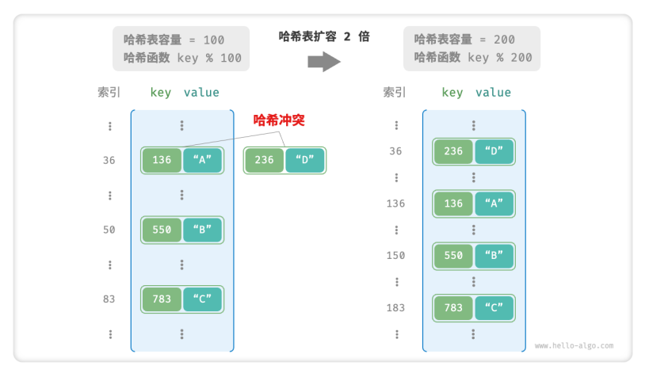

# hash table

- implement efficient element query by establishing a mapping between key and value.
    
- we enter a key `key` into the hash table, then we can get the corresponding value `value` within `O(1)` time.
    
- common operations
    
    ```cpp
    // declare a hash table
    unordered_map<int, string> map;
    // add
    map[1] = '1';
    map[2] = '2';
    // get
    string name = map[2];
    // remove
    map.erase(2);
    // traverse
    for(auto kv: map){
    count << kv.first << "->" << kv.second << endl;
    }
    for(auto key:map){
    count << kv.first << endl;
    }
    for(auto val:map){
    count << val.second << endl;
    }
    ```
    
- We first consider the simplest case, implementing a hash table using only an array. In a hash table, each empty slot in the array is referred to as a 'bucket,' and each bucket can store one key-value pair. Therefore, the query operation involves finding the bucket corresponding to the key and retrieving the value from that bucket.
    
- So, how do we determine the appropriate bucket based on the key? This is achieved through a 'hash function.' The role of a hash function is to map a larger input space to a smaller output space. In the context of a hash table, the input space consists of all keys, and the output space consists of all buckets (array indices). In other words, given a key, we can use the hash function to determine the storage location of the corresponding key-value pair in the array.
    
- The computation process of the hash function involves the following two steps when given a key.
    
    - 1: The hash value is calculated using a hash algorithm, typically through the hash() function.
    - 2: The hash value is then subjected to modulo the number of buckets (array length), denoted as the capacity, to obtain the array index corresponding to the key.

```
index = hash(key) % capacit
```

- Subsequently, we can use the obtained index to access the corresponding bucket in the hash table, thereby retrieving the value.
    
- Suppose the array length is capacity = 100, and the hash algorithm is hash(key) = key. It follows that the hash function is key % 100.
    


```cpp
struct Pair{
    public:
        int key;
        string val;
    Pair(int key, string val){
        this -> key = key;
        this -> val = val;
    }
};

class ArrayHashMap{
    private:
        vector<Pair *> buckets;

    public:
        ArrayHashMap(){
            buckets = vector<Pair *>(100);
        }

        ~ArrayHashMap(){
            for(const auto &bucket: buckets){
                delete bucket;
            }
            buckets.clear();
        }

        int hashFunc(int key){
            return key%100;
        }

        string get(int key){
            int index = hashFunc(key);
            Pair *pair = buckets[index];
            if(pair == nullptr)
                return nullptr;
            return pair->val;
        }

        void put(int key,string val){
            Pair *pair = new Pair(key,val);
            int index = hashFunk(key);
            buckets[index] = pair;
        }

        void remove(int key){
            int index = hashFunc(key);
            delete buckets[index];
            buckets[index] = nullptr;
        }

        vector<Pair *>pairSet(){
            vector<Pair *> pairSet;
            for(Pair *pair: buckets){
                if(pair != nullptr){
                    pairSet.push_back(pair);
                }
            }
            return pairSet;
        }

        vector<int> keySet(){
            vector<int> keySet;
            for (Pair *pair : buckets) {
                if (pair != nullptr) {
                    keySet.push_back(pair->key);
                }
            }
            return keySet;
        }

        vector<string> valueSet(){
            vector<string> valueSet;
            for(Pair *pari: buckets){
                if(pair != nullptr){
                    valueSet.push_back(pair->val);
                }
            }
            return valueSet;
        }

        void print(){
            for (Pair *kv : pairSet()) {
                cout << kv->key << " -> " << kv->val << endl;
            }
        }
}
```

# hash collision & expansion

- When the input space is larger than the output space, theoretically, there must be a situation where "multiple inputs correspond to the same output. 
    
- We refer to the situation where multiple inputs correspond to the same output as "hash collision.
    
- The larger the capacity 𝑛 of the hash table, the lower the probability of multiple keys being assigned to the same bucket, and consequently, the fewer collisions. Therefore, we can reduce hash collisions by increasing the capacity of the hash table through resizing. 
    
- Similar to array resizing, the process of expanding a hash table involves migrating all key-value pairs from the original hash table to a new one, which is a time-consuming task. Additionally, due to the change in the hash table's capacity, it is necessary to recalculate the storage positions for all key-value pairs through the hash function, further increasing the computational overhead of the resizing process. Therefore, programming languages often allocate a sufficiently large initial hash table capacity to prevent frequent resizing.
    
- The "load factor" is a crucial concept for a hash table, defined as the ratio of the number of elements in the hash table to the number of buckets. It is used to measure the severity of hash collisions and is often employed as a trigger condition for hash table resizing. For instance, in Java, when the load factor exceeds 0.75, the system expands the hash table's capacity to twice its original size.
    

# hash collision

- Usually the input space of a hash function is much larger than the output space. so in theory hash collision are inevitable.
    
- For example: lose if the input space is all integers and the output space is the array capacity, there must be multiple intergers mapped to the same bucket index.
    
- Hash conflicts will lead to incorrect query results and seriously affect the availability of the hash table, To solve this problem, we can just expand the hash table until conflicts dispappear, This method is simple, crude and effective, but the efficiency is too low because the expansion of the hash table requires a lot of Data handing and hash value calculation. To improve efficiency, we can adopt the following strategies.
    
    - Improve the hash table data structure so that the hash table can work normally when there is a hash conflict.
        - chain address
        - open addressing
    - Only perform expansion operations when necessary, that is, when hash conflicts are serious.

## hash collision: chain address

- separate chaining: convert a single element to a linked list, convert Key-value pairs serve as linked list nodes, and all conflicting key-value pairs are stored in the same linked list.

```
// hash function: key%100
index       array       linkd list(key-value pair nodes)
00      200:A       500:F       300:J
37      937:B       637:G       437:K       237:M
```

- The operation method of the hash table implemented based on chain addresses has undergone the following changes:
    - Query element: enter key, get the bucket index through the hash function, and then access the head node of the linked list, then traverse the linked list and compare the key to check.
    - Add elements: first access the head node of the linked list through the hash function, and then add the node(i.e. key-value pair) to the linked list.
    - Delete elements: access the head of the linked list based on the result of the hash funtion, then traverse the linked list to find the target node and delete it.
- Chained addresses have the following limitations:
    - The occupied space increases. The linked list contains node pointers, which consumes more memory space than array.
    - Query efficiency is reduced because linear traversal of the linked list is required to find the corresponding element.

Simple implementation of chained address hash table.

```cpp
class HashMapChaining{
    private:
        int size;
        int capacity;
        double loadThres;
        int extendRatio;
        vector<vector<Pair *>> buckets;

    public:
        HashMapChaning(): size(0), capacity(4), loadThres(2.0/3.0), extendRatio(2){
            buckets.resize(capacity);
        }
        ~HashMapChaning(){
            for(auto &bucket: buckets){
                for(Pair *pair: bucket){
                    delete pair;
                }
            }
        }

        int hashFunc(int key){
            return key%capacity;
        }

        double loadFactor(){
            return (double)size / (double)capacity;
        }

        string get(int key){
            int index = hashFucn(key);
            for(Pair *pair: buckets[index]){
                if(pair->key == key){
                    return pair->val;
                }
            }
            return "";
        }

        void put(int key,string val){
            // when the load factor exceeds the threshold, perform expansion
            if(loadFactor()>loadThres){
                extend();
            }
            int index = hashFunc(key);
            for(Pair *pair: buckets[index]){
                if(pair -> key == key){
                    pair -> val = val;
                    return;
                }
            }
            // not found the key
            buckets[index].push_back(new Pair(key,val));
            size++;
        }

        void remove(int key){
            int index = hashFunc(key);
            auto &bucket = buckets[index];
            for(int i =0;i<bucket.size;i++){
                if(bucket[i]->key == key){
                    Pair *tmp = bucket[i];
                    bucket.erase(bucket.begin()+i);
                    delete tmp;
                    size --;
                    return;
                }
            }
        }

        void extend(){
            vector<vector<Pair *>> bucketsTmp = buckets;
            capacity *= extendRatio;
            buckets.clear();
            buckets.resize(capacity);
            size =0;
            for(auto &bucket:bucketsTmp){
                for(Pair *pair: bucket){
                    put(pair->key,pair->val);
                    delete pair;
                }
            }
        }

        void print(){
            for(auto &bucket: buckets){
                cout <<"["
                for(Pair * pair:bucket){
                    count << pair -> key << " -> " << pair->val << ",";
                }
                ccccout  << "]\n";
            }
        }
}
```

- Query efficiency: `O(n)`
- Convert linked list to "AVL tree" or "red-black tree": `O(log n)`

## hash collision: open addressing

- Open address: Handled through "multiple detections", and the detection method is mainly including linear detection, square detection, multiple hashing, etc.
- Linear detection: Detection is performed using a linear search with a fixed step size.
    - Insert element: Calculate the bucket index through the hash function, if it is found that there is already an element in the bucket, linearly traverse backward from the conflict position(the step size is usually 1) until an empty bucket is found and the element is inserted into it.
    - Find elements: If a hash conflict is found, linearly traverse backwards using the same step size until the corresponding element is found, and return value
    - Linear detection is prone to "aggregation phenomenon": The longer the continuously occupied positions in the array, the more hash collisions occur at these consecutive positions. The greater the possibility of conflict, which will further promote the growth of clusters at this location, forming a vicious circle, and ultimately leading to a deterioration in the efficiency of additions, deletions, checking and modification operations.
    - Elements cannot be deleted directly in an open-addressed hash table: Deleting an element creates an empty bucket within the arr None, and when querying elements, linear detection of the empty bucket will return, so the elements under the empty bucket can no longer be accessed, the program it may be misjudged that these elements do not exist.
    - Lazy deletion: Swap the element that was deleted by `TOMBSTONE`. Lazy deletion may accelerate performance degradation of hash tables.

Implementing an open-addressed(linear probing) hash table with lazy deletion.

```cpp
class HashMapOpenAddressing
{
private:
    int size;                             
    int capacity = 4;                     
    const double loadThres = 2.0 / 3.0;   
    const int extendRatio = 2;            
    vector<Pair *> buckets;               
    Pair *TOMBSTONE = new Pair(-1, "-1"); 
public:
    HashMapOpenAddressing() : size(0), buckets(capacity, nullptr)
    {
    }
    ~HashMapOpenAddressing()
    {
        for (Pair *pair : buckets)
        {
            if (pair != nullptr && pair != TOMBSTONE)
            {
                delete pair;
            }
        }
        delete TOMBSTONE;
    }
    int hashFunc(int key)
    {
        return key % capacity;
    }
    double loadFactor()
    {
        return (double)size / capacity;
    }
    int findBucket(int key)
    {
        int index = hashFunc(key);
        int firstTombstone = -1;
        while (buckets[index] != nullptr)
        {
            if (buckets[index]->key == key)
            {
                if (firstTombstone != -1)
                {
                    buckets[firstTombstone] = buckets[index];
                    buckets[index] = TOMBSTONE;
                    return firstTombstone;
                }
                return index; 
            }
            if (firstTombstone == -1 && buckets[index] == TOMBSTONE)
            {
                firstTombstone = index;
            }
            index = (index + 1) % capacity;
        }
        return firstTombstone == -1 ? index : firstTombstone;
    }
    string get(int key)
    {
        int index = findBucket(key);
        if (buckets[index] != nullptr && buckets[index] != TOMBSTONE)
        {
            return buckets[index]->val;
        }
        return "";
    }
    void put(int key, string val)
    {
        if (loadFactor() > loadThres)
        {
            extend();
        }
        int index = findBucket(key);
        if (buckets[index] != nullptr && buckets[index] != TOMBSTONE)
        {
            buckets[index]->val = val;
            return;
        }
        buckets[index] = new Pair(key, val);
        size++;
    }
    void remove(int key)
    {
        int index = findBucket(key);
        if (buckets[index] != nullptr && buckets[index] != TOMBSTONE)
        {
            delete buckets[index];
            buckets[index] = TOMBSTONE;
            size--;
        }
    }
    void extend()
    {
        vector<Pair *> bucketsTmp = buckets;
        capacity *= extendRatio;
        buckets = vector<Pair *>(capacity, nullptr);
        size = 0;
        for (Pair *pair : bucketsTmp)
        {
            if (pair != nullptr && pair != TOMBSTONE)
            {
                put(pair->key, pair->val);
                delete pair;
            }
        }
    }
    void print()
    {
        for (Pair *pair : buckets)
        {
            if (pair == nullptr)
            {
                cout << "nullptr" << endl;
            }
            else if (pair == TOMBSTONE)
            {
                cout << "TOMBSTONE" << endl;
            }
            else
            {
                cout << pair->key << " -> " << pair->val << endl;
            }
        }
    }
};
```

- square detection
    
    - skip the number of steps "squared of the number of probes", i.e. 1,4,9 steps
    - square probing attempts to alleviate the clustering of linear probing by skipping squared distances.
    - square detection skips larger distances to find empty locations, helping the data be distributed more evenly.
    - There is a clustering phenomenon, that is, some locations are more likely to be occupied than others.
    - Due to squared growth, square probing my not probe the entire hash table, which means that event if there are empty buckets in the hash table, square probing my it cannot be accessed.
- Hash multiple times: uses multiple hash functions `f1(x) f2(x) f3(x)...` for detection.
    
    - Compared with linear detection, multiple hashing methods are less likely to produce aggregation, but multiple hashing functions will increase the amount of additional calculations.
- Choice of programming language
    
    - Java: Since JDK 1.8, when the length of the array in the HashMap reaches 64 and the length of the linked list reaches 8, the linked list will converted to a red-black tree to improve search performance.
    - Python: use open addressing. Dictionary dict uses pseudo-random numbers for probing.
    - Golang: use chained addresses. Go stipulates that each bucket can store up to 8 key-value pairs. If the capacity is exceeded, and overflow bucket will be connected. when the bucket overflows when it is too large, a special equal expansion operation will be performed to ensure performance.
