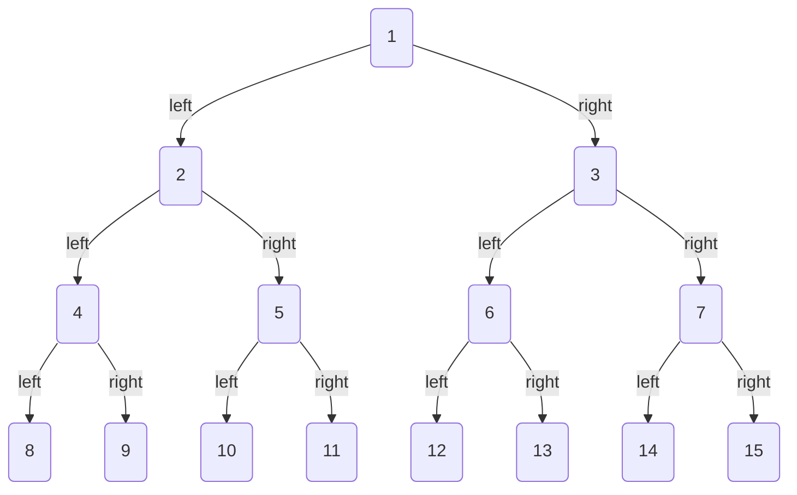
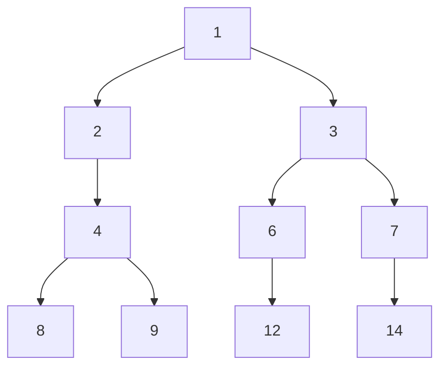
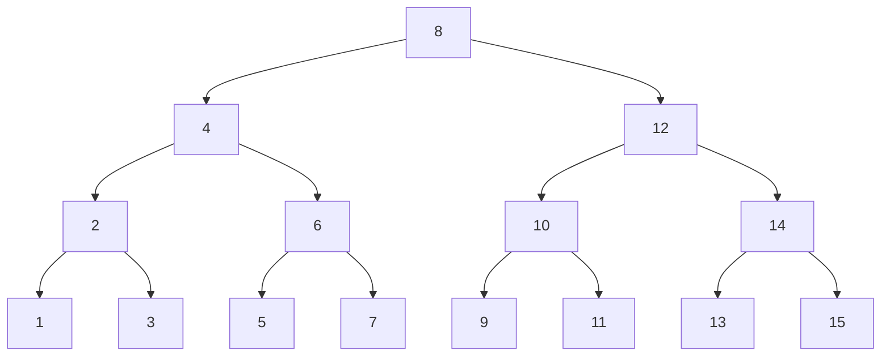

# Array representation of a binary tree

## Represent a perfect binary tree



- "Mapping formula" between parent node index and childnode index.
    - the index of a node is `i`.
    - the left child node index of node is `2i+1`.
    - the right child node index is `2i+2`

## Represents any binary tree



```
array index: 0,1,2,3,4,5,6,7,8,9
iterative sequence: 1,2,3,4,6,7,8,9,12,15
```

- the tow sequences do not satisfy the rules of a perfect binary tree.
- We can consider explicitly writing out all None in the level-order traversal sequence.

```C++
vector<int> tree = {1,2,3,4,INT_MAX,6,7,8,9,INT_MAX,INT_MAX,12,INT_MAX,INT_MAX,15}
```

- now the sequence becomes
    
    ```
    array index: 0,1,2,3,4,5,6,7,8,9
    iterative sequence: 1,2,3,4,_,6,7,8,9,_,_,12,_,_,15
    ```
    
- code
    

```c++
class ArrayBinaryTree {
  public:
    ArrayBinaryTree(vector<int> arr) {
        tree = arr;
    }

    int size() {
        return tree.size();
    }

    int val(int i) {

        if (i < 0 || i >= size())
            return INT_MAX;
        return tree[i];
    }

    int left(int i) {
        return 2 * i + 1;
    }

    int right(int i) {
        return 2 * i + 2;
    }

    int parent(int i) {
        return (i - 1) / 2;
    }

    vector<int> levelOrder() {
        vector<int> res;

        for (int i = 0; i < size(); i++) {
            if (val(i) != INT_MAX)
                res.push_back(val(i));
        }
        return res;
    }

    vector<int> preOrder() {
        vector<int> res;
        dfs(0, "pre", res);
        return res;
    }

    vector<int> inOrder() {
        vector<int> res;
        dfs(0, "in", res);
        return res;
    }

    vector<int> postOrder() {
        vector<int> res;
        dfs(0, "post", res);
        return res;
    }

  private:
    vector<int> tree;

    void dfs(int i, string order, vector<int> &res) {

        if (val(i) == INT_MAX)
            return;

        if (order == "pre")
            res.push_back(val(i));
        dfs(left(i), order, res);

        if (order == "in")
            res.push_back(val(i));
        dfs(right(i), order, res);

        if (order == "post")
            res.push_back(val(i));
    }
};
```

# Binary search tree



- "Binary serch tree" satisfiles the following coditions.
    - for the root node the values of all nodes in the left subtree < the value of the root node < the values of all nodes in the right subtree.
    - the left and right subtrees of any node are also binary search trees, that is, they also meet condition `1`.

## Search

When looking for element `i`, if `i < node`, then move to the left child node, if `i > node`, then move to the right child node until the value is found or the current nodes has no child nodes.

```c++
TreeNode *search(int num){
    TreeNode *cur = root;
    while(cur != nullptr){
        if(cur -> val <num)
            cur = cur -> right;
        else if(cur -> val > num)
            cur = cur -> left;
        else 
            break;
    }
    return cur;
}
```

## Insert

```c++
void insert(int num) {
    if (root == nullptr) {
        root = new TreeNode(num);
        return;
    }
    TreeNode *cur = root, *pre = nullptr;

    while (cur != nullptr) {

        if (cur->val == num)
            return;
        pre = cur;

        if (cur->val < num)
            cur = cur->right;

        else
            cur = cur->left;
    }

    TreeNode *node = new TreeNode(num);
    if (pre->val < num)
        pre->right = node;
    else
        pre->left = node;
}
```

In code implementation, you need to pay attention to the following two points.

- Binary search trees do not allow duplicate nodes, otherwise it would violate its definition. Therefore, if the node to be inserted already exists in the tree, the insertion will not be performed and will be returned directly.
- In order to insert nodes, we need to use node pre to save the nodes of the previous cycle. In this way, when traversing to None, we can get its parent node and complete the node insertion operation.

# Delete

```c++
void remove(int num) {
    if (root == nullptr)
        return;
    TreeNode *cur = root, *pre = nullptr;
    while (cur != nullptr) {
        if (cur->val == num)
            break;
        pre = cur;
        if (cur->val < num)
            cur = cur->right;
        else
            cur = cur->left;
    }

    if (cur == nullptr)
        return;

    if (cur->left == nullptr || cur->right == nullptr) {

        TreeNode *child = cur->left != nullptr ? cur->left : cur->right;

        if (cur != root) {
            if (pre->left == cur)
                pre->left = child;
            else
                pre->right = child;
        } else {

            root = child;
        }

        delete cur;
    }

    else {

        TreeNode *tmp = cur->right;
        while (tmp->left != nullptr) {
            tmp = tmp->left;
        }
        int tmpVal = tmp->val;

        remove(tmp->val);

        cur->val = tmpVal;
    }
}
```
