# The avl tree

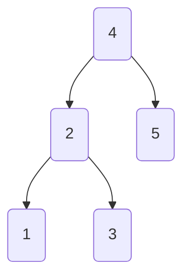

- delete node `5`

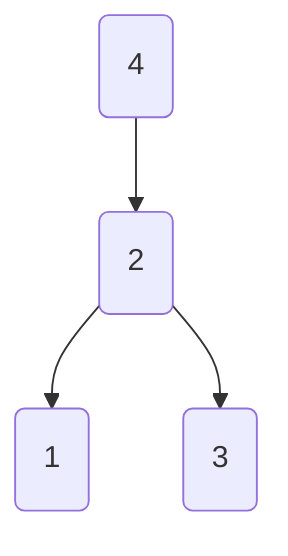

- delete node `3`

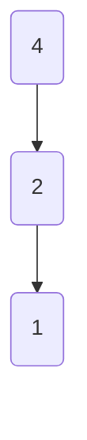

- In the "Binary Search Tree" chapter we mentioned that after multiple insertion and deletion operations, a binary search tree may degenerate into a linked list.
    
- In this case, the time complexity of all operations will change from `O(log n)` degraded to `O(n)`
    

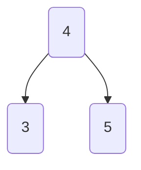

- inser node `2`

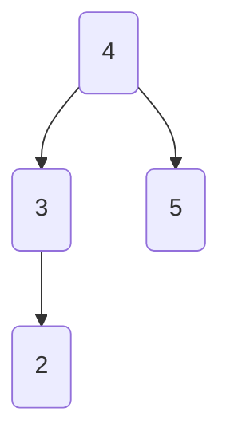

- inser node `1`

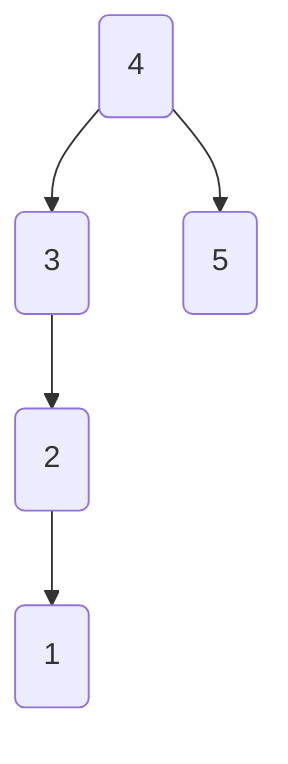

- AVL tree degenerates after inserting node

# AVL Tree common terms

- The AVL tree is both a binary search tree and a balanced binary tree. It meets all the properties of these two types of binary trees at the same time, so it is a "balanced binary search tree".
    
- Node height
    
    - refers to the distance from the node to its farthest leaf node, that is, the number of "edges" passed. It is important to note that the height of the leaf node is 0, and the height of the empty node is -1.

```c++
struct TreeNode {
    int val{};
    int height = 0;
    TreeNode *left {};
    TreeNode * right {};
    TreeNode() = default;
    explicit TreeNode(int x) : val(x){}
}

int height(TreeNode *node){
    return node == nullptr? -1: node->height;
}

void updateHeight(TreeNode *node){
    node -> height = max(height(node->left),height(node->right))+1;
}
```

- Node balancing factor
    - the balance factor of a node is defined as the height of the node's left subtree minus the height of the right subtree. It also stipulates that the balance factor of an empty node is 0.

```c++
int balanceFactor(TreeNode *node){
    if (node == nullptr)
        return 0;
    return height(node->left) - height(node->right);
}
```

# AVL Tree rotation

- The rotation operation can not only maintain the properties of a "binary search tree", but also turn the tree into a "balanced binary tree" again.
    
- We refer to nodes with an absolute value of `balance factor > 1` as “imbalanced nodes”. Depending on the node imbalance
    
- the rotation operation is divided into four types: `right rotation`, `left rotation`, `right rotation first and then left rotation`, `left rotation first and then right rotation`.
    

## right-hand rotation

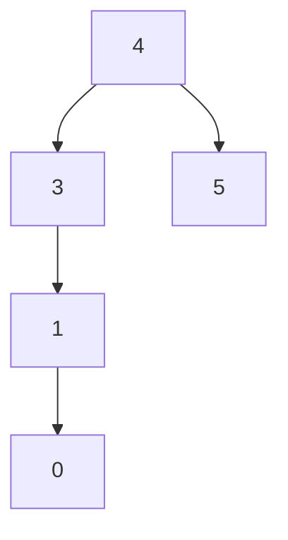

- `node 4` and `node 3` was imbalanced node.

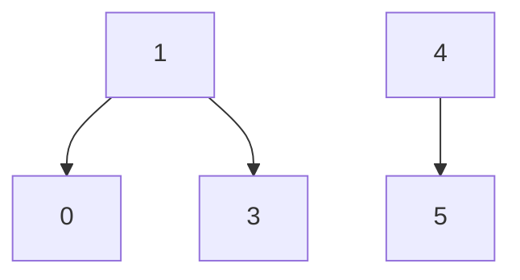

- `node 3` turn right


- restore balance

```c++
TreeNode *rightRotate(TreeNode *node){
    TreeNode *child = node->left;
    TreeNode *grandChild = child->right;
    child->right = node;
    node->left = grandChild;
    updateHeight(node);
    updateHeight(child);
    return child;
}
```

## left-hand rotation

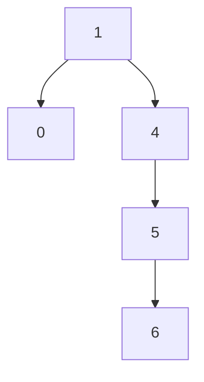

- `node 4` was imbalanced node.

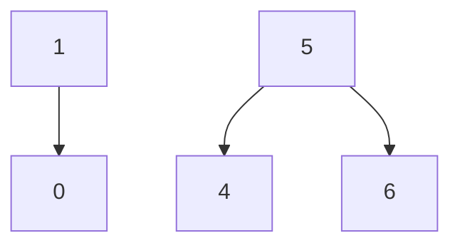

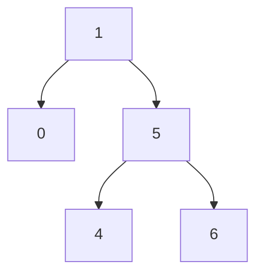

```c++
TreeNode *leftRotate(TreeNode *node){
    TreeNode *child = node -> right;
    TreeNode *grandChild = child -> left;
    child -> left = node;
    node -> right = grandChild;
    updateHeight(node);
    updateHeight(child);
    return child;
}
```

## First rotate left and then rotate right


- `node 1` turn left


- `node 3` turn right

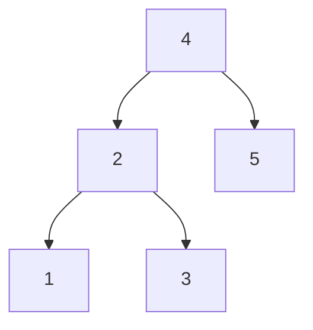

## First turn right and then turn left


- `node 5` turn right


- `node 3` turn left


## Rotating options

| Balance factor for unbalanced nodes | Balance factor of child node | The rotation method to use |
| --- | --- | --- |
| \> 1 (left-biased tree) | \>= 0 | Right-hand rotation |
| \> 1 (left-biased tree) | < 0 | First rotate left and then rotate right |
| < -1 (Right-skewed tree) | <= 0 | Left-handed |
| < -1 (Right-skewed tree) | \> 0 | First turn right and then turn left |

```c++
TreeNode *rotate(TreeNode *node) {
    int _balanceFactor = balanceFactor(node);
    if (_balanceFactor > 1) {
        if (balanceFactor(node->left) >= 0) {
            return rightRotate(node);
        } else {
            node->left = leftRotate(node->left);
            return rightRotate(node);
        }
    }
    if (_balanceFactor < -1) {
        if (balanceFactor(node->right) <= 0) {
            return leftRotate(node);
        } else {
            node->right = rightRotate(node->right);
            return leftRotate(node);
        }
    }
    return node;
}
```

- insert

```c++
void insert(int val) {
    root = insertHelper(root, val);
}

TreeNode *insertHelper(TreeNode *node, int val) {
    if (node == nullptr)
        return new TreeNode(val);
    if (val < node->val)
        node->left = insertHelper(node->left, val);
    else if (val > node->val)
        node->right = insertHelper(node->right, val);
    else
        return node;    
    updateHeight(node); 
    node = rotate(node);
    return node;
}
```

- delete

```c++
void remove(int val) {
    root = removeHelper(root, val);
}

TreeNode *removeHelper(TreeNode *node, int val) {
    if (node == nullptr)
        return nullptr;

    if (val < node->val)
        node->left = removeHelper(node->left, val);
    else if (val > node->val)
        node->right = removeHelper(node->right, val);
    else {
        if (node->left == nullptr || node->right == nullptr) {
            TreeNode *child = node->left != nullptr ? node->left : node->right;

            if (child == nullptr) {
                delete node;
                return nullptr;
            }

            else {
                delete node;
                node = child;
            }
        } else {

            TreeNode *temp = node->right;
            while (temp->left != nullptr) {
                temp = temp->left;
            }
            int tempVal = temp->val;
            node->right = removeHelper(node->right, temp->val);
            node->val = tempVal;
        }
    }
    updateHeight(node); 

    node = rotate(node);

    return node;
}
```
