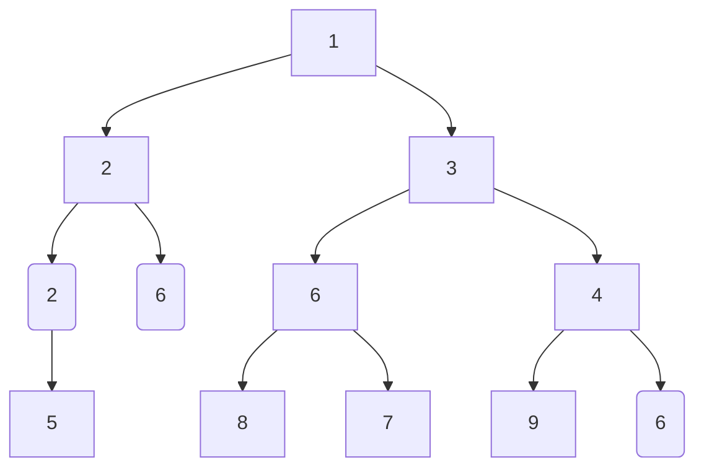
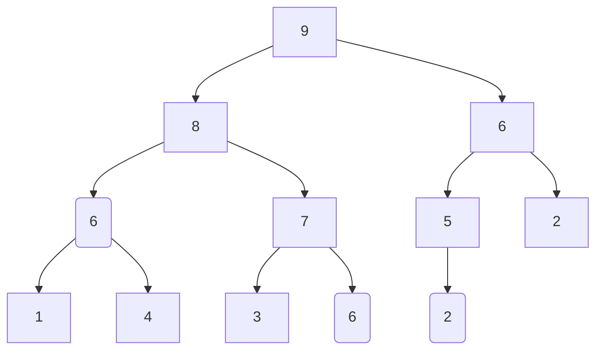
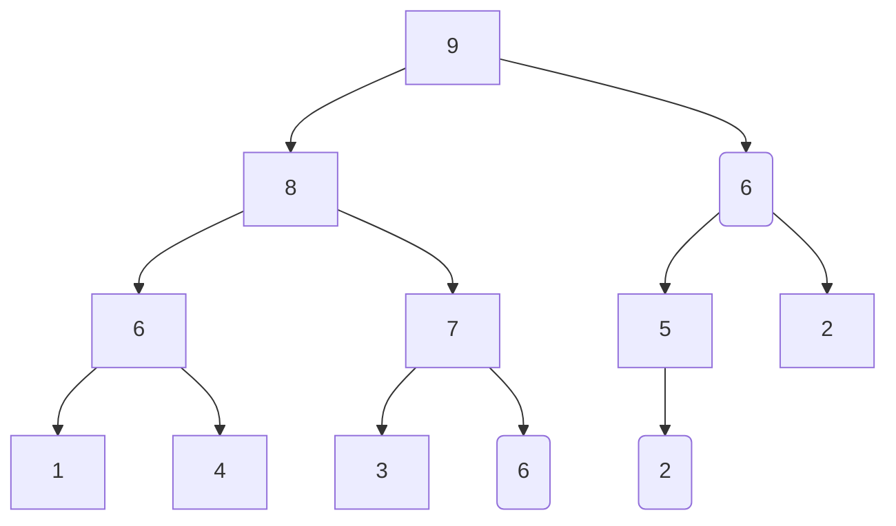

# Heap

- Heap is a complete binary tree that meets certain conditions.
- Mainly can be divided into two types.
    - min heap
        - The value of any node <= The value of its child node
    - max heap
        - The value of any node >= The value of its child node





- The lowest layer nodes are filled to the left, and the nodes in other layers are filled.
- We call the root node of the binary tree the "top of the heap" and the rightmost node at the bottom of the tree the "bottom of the heap".
- For a large top heap (small top heap), the value of the top element (root node) of the heap is the largest (minimum).

# Heap implementation

- Since the heap is a complete binary tree, we will use an array to store the heap.



```
[ 9 , 8 , 6 , 6 , 7 , 5 , 2 , 1 , 4 , 3 , 6 , 2]
```

- given index `i`
- the index of its left child node is `2i+1`
- the index of the right child node is `2i+2`
- the index of the parent node is `( i - 1 )/2`
- when the index is out of bounds, it means an empty node or the node does not exist.

```c++
int left(int i){
    return 2*i + 1;
}

int right(int i){
    return 2*i + 2;
}

int parent(int i){
    return (i-1)/2;
}

int peek(){
    return maxHeap[0];
}
```

- Elements into heap
    - Given an element val , we first add it to the bottom of the heap.
    - After addition, since val may be larger than other elements in the heap, the establishment condition of the heap may have been destroyed, so each node on the path from the insertion node to the root node needs to be repaired.
    - This operation is called "heapify".
- Let the total number of nodes be `n` , then the height of the tree is `O(log n)`.
    - It can be seen that the maximum number of cycles of the heap operation is `O(log n)`.
    - The time complexity of adding elements to the heap is `O(log n)`.

```c++
void push(int val){
    maxHeap.push_back(val);
    // heapify
    siftup(size() -1);
}

void siftUp(int i){
    while (true){
        int p = parent(i);
        if( p < 0 || maxHeap[i] <= maxHeap[p]) 
            break;
        swap(maxHeap[i],maxHeap[p]);
        i = p;
    }
}
```

- the top element of the heap is removed from the heap
    - The top element of the heap is the root node of the binary tree, which is the first element of the list. If we directly delete the first element from the list, the indexes of all nodes in the binary tree will change, which will make subsequent repairs using heapization difficult. In order to minimize changes in element indexes, we use the following steps.
    - Swap the top element and the bottom element of the heap (exchange the root node and the rightmost leaf node).
    - After the exchange is completed, the bottom of the heap is deleted from the list (note that since it has been exchanged, the original top element of the heap is actually deleted).
    - Starting from the root node, heapification is performed from top to bottom.

```c++
void pop(){
    if(isEmpty()){
        throw out_of_range("heap is null");
    }
    swap(maxHeap[0],maxHeap[size()-1]);
    maxHeap.pop_back();
    siftDown(0);
}

void siftDown(int i){
    while(true){
        int l = left(i), r = right(i), ma = i;
        if (l < size() && maxHeap[l] > maxHeap[ma])
            ma = l;
        if (r < size() && maxHeap[r] > maxHeap[ma])
            ma = r;
        if (ma == i)
            break;
        swap(maxHeap[i], maxHeap[ma]);
        i = ma;
    }
}
```
