# Graph

- "Graph" is a non-linear data structure consisting of "vertex" and "edge".
- We can take the picture `G` abstractly represented as a set of vertices `V` and a set of edges `E` collection.

```
V = { 1,2,3,4,5,}
E = {(1,2),(1,3),(1,5),(2,3),(2,4),(2,5),(4,5)}
G = {V,E}
```

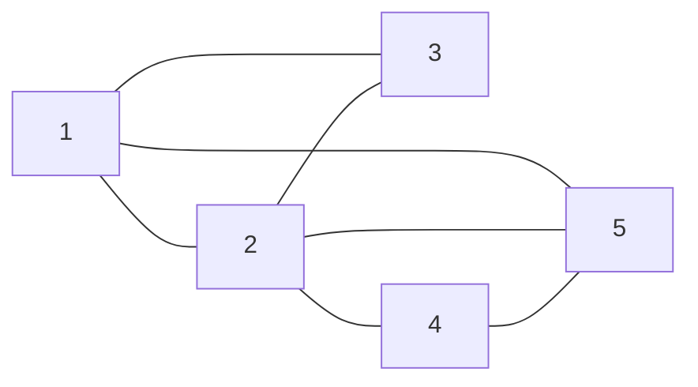

# Common types and terms of graphs

- Depending on whether the edge has a direction
    - undirected graph
    - directed graph
- According to whether all vertices are connected
    - connected graph
    - disconnected graph
- Weights
    - weighted graph
- Adjacency
    - when there is an edge connecting two vertices, they are called 'adjacency'.
- Path
    - The sequence of edges passing from vertex A to vertex B is called the path from A to B.
- Degree
    - The number of edges a vertex has
    - For a directed graph, "in degree" indicates how many edges point to the vertex, and "out-degree" indicates how many edges point from the vertex.

# Representation of graph

- Adjacency matrix
- Adjacency list

## adjacency matrix

| blank | 1 | 3 | 2 | 5 | 4 |
| --- | --- | --- | --- | --- | --- |
| index | 0 | 1 | 2 | 3 | 4 |
| 0 | 0 | 1 | 1 | 1 | 0 |
| 1 | 1 | 0 | 1 | 0 | 0 |
| 2 | 1 | 1 | 0 | 1 | 1 |
| 3 | 1 | 0 | 1 | 0 | 1 |
| 4 | 0 | 0 | 1 | 1 | 0 |

## graph

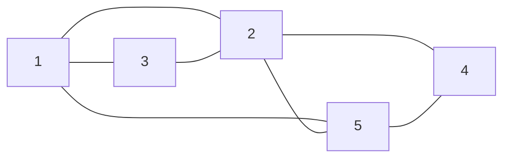

- The adjacency matrix has the following properties.
    - A vertex cannot be connected to itself, so the main diagonal elements of the adjacency matrix have no meaning.
    - For an undirected graph, the edges in both directions are equivalent, and the adjacency matrix is symmetric about the main diagonal.
    - Change the elements of the adjacency matrix from 1 and 0 Replaced by weight, it can represent a weighted graph.

# Basic operations on graphs

- The basic operations of graphs can be divided into operations on "edges" and operations on "vertices".
- The implementation methods are different under the two representation methods of "adjacency matrix" and "adjacency list".

## Implementation based on adjacency matrix

- initialization

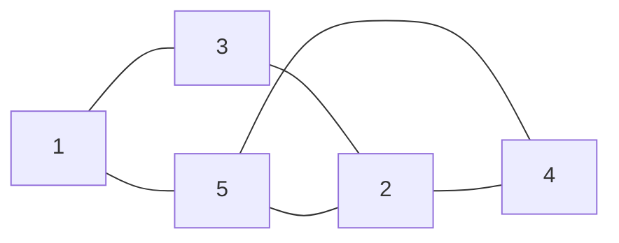

| list | 1 | 3 | 2 | 5 | 4 |
| --- | --- | --- | --- | --- | --- |
| index | 0 | 1 | 2 | 3 | 4 |
| 0 | 0 | 1 | 0 | 1 | 0 |
| 1 | 1 | 0 | 1 | 0 | 0 |
| 2 | 0 | 1 | 0 | 1 | 1 |
| 3 | 1 | 0 | 1 | 0 | 1 |
| 4 | 0 | 0 | 1 | 1 | 0 |

- add edge `1 - 2`

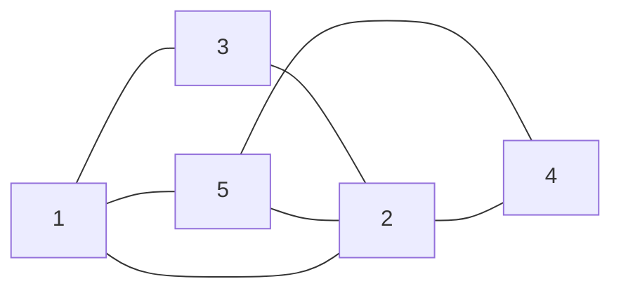

| list | 1 | 3 | 2 | 5 | 4 |
| --- | --- | --- | --- | --- | --- |
| index | 0 | 1 | 2 | 3 | 4 |
| 0 | 0 | 1 | `1` | 1 | 0 |
| 1 | 1 | 0 | 1 | 0 | 0 |
| 2 | `1` | 1 | 0 | 1 | 1 |
| 3 | 1 | 0 | 1 | 0 | 1 |
| 4 | 0 | 0 | 1 | 1 | 0 |

- remove edge `1 - 3`

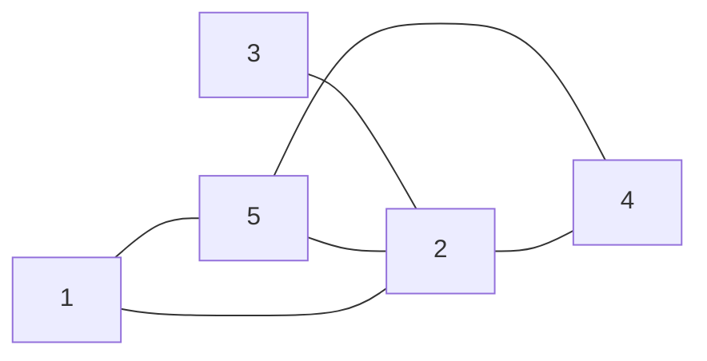

| list | 1 | 3 | 2 | 5 | 4 |
| --- | --- | --- | --- | --- | --- |
| index | 0 | 1 | 2 | 3 | 4 |
| 0 | 0 | `0` | 1 | 1 | 0 |
| 1 | `0` | 0 | 1 | 0 | 0 |
| 2 | 1 | 1 | 0 | 1 | 1 |
| 3 | 1 | 0 | 1 | 0 | 1 |
| 4 | 0 | 0 | 1 | 1 | 0 |

- add vertex

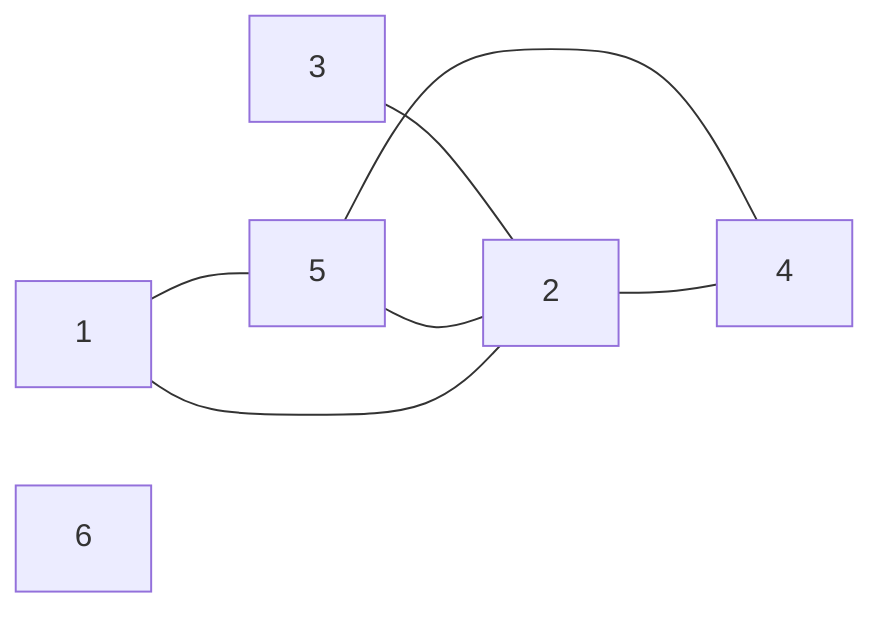

| list | 1 | 3 | 2 | 5 | 4 | 6 |
| --- | --- | --- | --- | --- | --- | --- |
| index | 0 | 1 | 2 | 3 | 4 | 5 |
| 0 | 0 | 1 | 1 | 1 | 0 | 0 |
| 1 | 1 | 0 | 1 | 0 | 0 | 0 |
| 2 | 1 | 1 | 0 | 1 | 1 | 0 |
| 3 | 1 | 0 | 1 | 0 | 1 | 0 |
| 4 | 0 | 0 | 1 | 1 | 0 | 0 |
| 5 | 0 | 0 | 0 | 0 | 0 | 0 |

### summary

- Given an undirected graph with n vertices
    - Add or remove edges
        - Just modify the specified edge directly in the adjacency matrix, using `O(1)` time. Since it is an undirected graph, edges in both directions need to be updated at the same time.
    - Add vertices
        - Just add a row and a column at the end of the adjacency matrix and fill them all with `0`, using `O(n)` time.
    - Delete vertices
        - Delete a row and a column in the adjacency matrix. The worst case is reached when deleting the first row and column, which requires `(n-1)^2` elements to be "moved up and to the left", thus using `O(n^2)` time.
    - Initialization
        - Pass in `n` vertices, initialize the vertices list of length `n`, use `O(n)` time; initialize the `n x n` size adjacency matrix `adjMat`, use `O(n^2)` time.

### code

```c++
class GraphAdjMat{
    // Vertex list, the element represents "vertex value", and the index represents "vertex index"
    vector<int> vertices;
    // Adjacency matrix, row and column index corresponds to "vertex index"
    vector<vector<int>> adjMat;

  public:
    GraphAdjMat(const vector<int> &vertices, const vector<vector<int>> &edges){
        for(int val: vertices){
            addVertex(val);
        }
        for(const vector<int> &edge: edges){
            addEdge(edge[0],edge[1]);
        }
      }

   void addVertex(int val) {
        int n = size();
        vertices.push_back(val);
        adjMat.emplace_back(vector<int>(n, 0));
        for (vector<int> &row : adjMat) {
            row.push_back(0);
        }
    }

  void removeVertex(int index)
  {
    if (index >= size())
    {
      throw out_of_range("vertex not found");
    }
    vertices.erase(vertices.begin() + index);

    adjMat.erase(adjMat.begin() + index);

    for (vector<int> &row : adjMat)
    {
      row.erase(row.begin() + index);
    }
}

   void addEdge(int i, int j) {
        if (i < 0 || j < 0 || i >= size() || j >= size() || i == j) {
            throw out_of_range("vertex not found");
        }
        // In an undirected graph, the adjacency matrix is symmetric about the main diagonal, that is, (i, j) == (j, i)
        adjMat[i][j] = 1;
        adjMat[j][i] = 1;
    }
}

   void removeEdge(int i, int j) {
        if (i < 0 || j < 0 || i >= size() || j >= size() || i == j) {
            throw out_of_range("vertex not found");
        }
        adjMat[i][j] = 0;
        adjMat[j][i] = 0;
    }

   void print() {
        cout << "vertex list = ";
        printVector(vertices);
        cout << "matrix =" << endl;
        printVectorMatrix(adjMat);
    }
```

## Implementation based on adjacency list

- Initialization

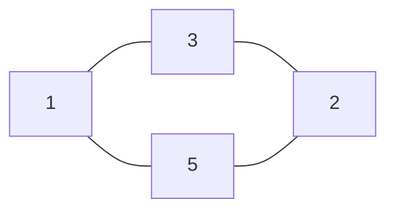

```
// adjacency list
1 -> 3,5
3 -> 1,2
2 -> 3,5
5 -> 1,2
```

- Add edge `1 - 2`

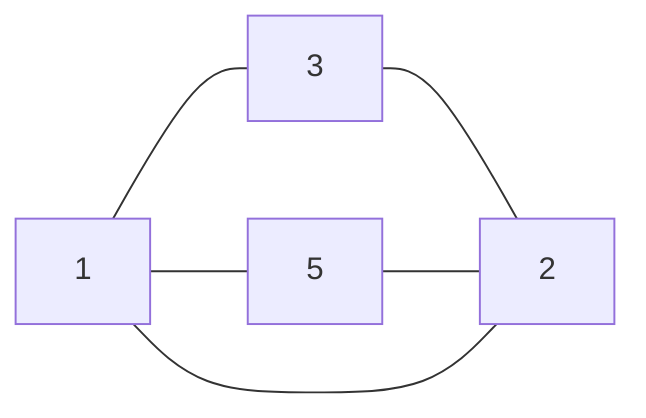

```
1 -> 2,3,5
3 -> 1,2
2 -> 1,3,5
5 -> 1,2
```

- Remove edge `1 - 3`

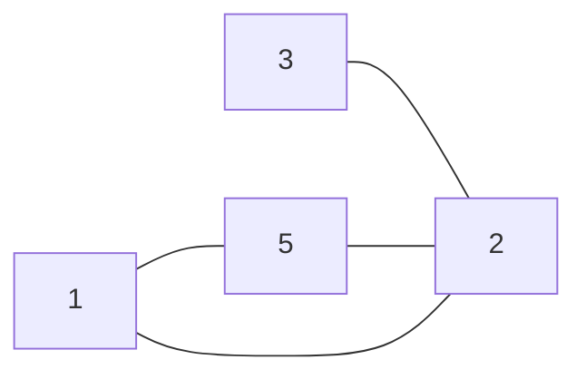

```
1 -> 2,5
3 -> 2
2 -> 1,3,5
5 -> 1,2
```

- Add vertex `6`

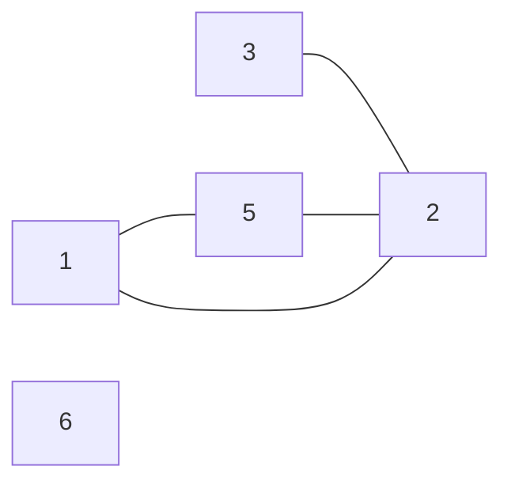

```
1 -> 2,5
3 -> 2
2 -> 1,3,5
5 -> 1,2
6 ->
```

- Remove vertex `3`

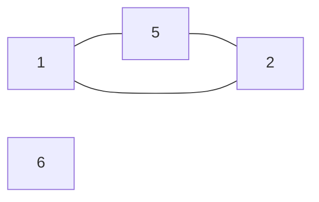

```
1 -> 2,5
2 -> 1,5
5 -> 1,2
6 ->
```

### sumary

- Assuming that the total number of vertices of the undirected graph is n and the total number of edges is `m`
- Add an edge: Just add an edge at the end of the linked list corresponding to the vertex, using `O(1)` time. Because it is an undirected graph, edges in both directions need to be added at the same time.
- Delete edge: Find and delete the specified edge in the linked list corresponding to the vertex, using `O(m)` time. In an undirected graph, edges in both directions need to be deleted at the same time.
- Add a vertex: Add a linked list to the adjacency list, and use the new vertex as the head node of the linked list, using `O(1)` time.
- Deleting a vertex: It is necessary to traverse the entire adjacency list and delete all edges containing the specified vertex, which takes `O(n+m)` time.
- Initialization: Create several `n` vertices and `2m` edges in the adjacency list, using `O(n+m)` time.

```c++
class GraphAdjList
{
public:
  void remove(vector<Vertex *> &vec, Vertex *vet)
  {
    for (int i = 0; i < vec.size(); i++)
    {
      if (vec[i] == vet)
      {
        vec.erase(vec.begin() + i);
        break;
      }
    }
  }

  GraphAdjList(const vector<vector<Vertex *>> &edges)
  {
    for (const vector<Vertex *> &edge : edges)
    {
      addVertex(edge[0]);
      addVertex(edge[1]);
      addEdge(edge[0], edge[1]);
    }
  }

  int size()
  {
    return adjList.size();
  }

  void addEdge(Vertex *vet1, Vertex *vet2)
  {
    if (!adjList.count(vet1) || !adjList.count(vet2) || vet1 == vet2)
      throw invalid_argument("vertex not found");
    adjList[vet1].push_back(vet2);
    adjList[vet2].push_back(vet1);
  }

  void removeEdge(Vertex *vet1, Vertex *vet2)
  {
    if (!adjList.count(vet1) || !adjList.count(vet2) || vet1 == vet2)
      throw invalid_argument("vertex not found");
    remove(adjList[vet1], vet2);
    remove(adjList[vet2], vet1);
  }

  void addVertex(Vertex *vet)
  {
    if (adjList.count(vet))
      return;
    adjList[vet] = vector<Vertex *>();
  }

  void removeVertex(Vertex *vet)
  {
    if (!adjList.count(vet))
      throw invalid_argument("vertex not found");
    adjList.erase(vet);
    for (auto &adj : adjList)
    {
      remove(adj.second, vet);
    }
  }

  void print()
  {
    cout << "table =" << endl;
    for (auto &adj : adjList)
    {
      const auto &key = adj.first;
      const auto &vec = adj.second;
      cout << key->val << ": ";
      printVector(vetsToVals(vec));
    }
  }
};
```
