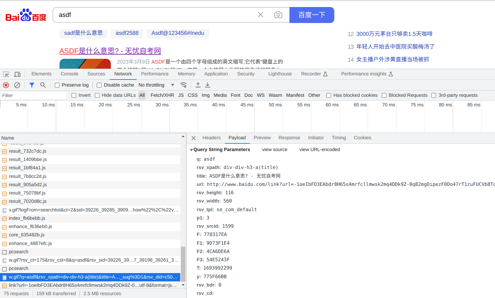
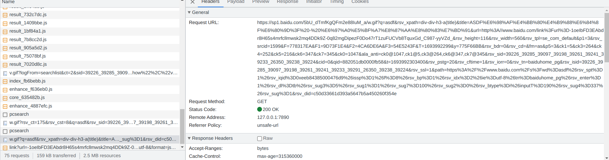

# What is the User Behavior Analysis Platform

The User Behavior Platform means monitor most of the events of the user on the page (the interaction process between the user and the page) Collect these data to establish an information system for user behavior analysis data reports.

# The role of the platform

- Simple User: Ordinary users, end users who actually use the services provided by the system.
    
- Website Developers: People who need to collect user data.
    
- Platform Developers: People who provide the User Behavior Platform infomation system to website developers.
    
- For ordinary users, the monitoring system should be imperceptible
    
- For website developers the monitoring system should be non-intrusive and easy to install for their code
    
- For us(Platform Developers) the above two roles should be considered when developing the platform.
    

# Specific functional module division

- Usage settings
    - Domain manager
    - Script generator
    - Script install status check
- Website Overview
    - Mainly make some charts, such as today's traffic, top10 entrance pages, new and old visitors, etc.
    - Mainly to make some diagrams.
- Traffic Analysis
    - Real time visitors
        - currently online visitors
        - access details
    - Trend analysis: this page reflects the ratio of the website's aggregate data to the time period selected by the user.
- Source Analysis
    - All sources: summarize the channels from which ordinary users enter this website
    - External link: if you enter this website by clicking an external link, which website is this external link on, and how many people visit this website through this external link?
- Access Analysis
    - Interviewed pages: which pages did users visit
    - Entry page: which is the first page the user visits
    - Visited domain names: which domain did users visit
    - Event analysis: construct an event type data dictionary through your own mapping to see which events are triggered by users during browsing and make statistics.
- Visitor Analysis
    - Geographical distribution: geographical distribution of visitors
    - System environment: what devices do visitors use to access your website?
    - New and old visitors: counting people

# Implement more difficult modules

## Question 1: how to install your JSSDK ?

```js
<script>
var _hmt = _hmt || [];
(function() {
  var hm = document.createElement("script");
  hm.src = "https://hm.baidu.com/hm.js?57951a08d69f0a7d7a44e050d416dc07";
  var s = document.getElementsByTagName("script")[0]; 
  s.parentNode.insertBefore(hm, s);
})();
</script>
```

The code above is an injection code for`Baidu Analysis` It performs the following actions:

- Dynamically creates a script element.
- Dynamically imports an `hm.js` (SDK) and adds a query parameter ('57951a08d69f0a7d7a44e050d416dc07').
- Mounts it to the document's script element.

If the browser's JavaScript parsing engine loads this code, the code will be executed. The code within the `hm.js` will then add an `EventListener` to monitor user behavior. So, you must provide a snippet like this and follow the `ID` parameter in the URL.

## Question2: How to get user source path?

- [document.referrer](https://developer.mozilla.org/en-US/docs/Web/API/Document/referrer)
- [utm](https://en.wikipedia.org/wiki/UTM_parameters)

## Question3: How to get real-time visitors?

We can add `timestamp` data to the sent data, and then count the events in the past one minute, and make `total` statistics according to the `user's unique identifier`.

## Question4: How to determine the unique identifier of an unregistered user?

- If the user does not have a unique website cookie, then generate one to determine whether it is the same user, but this method will have errors, the user may often clear the cookie, and the statistics will become multiple users.
- [user fingerprint](https://fingerprint.com/)

## Question5: How to determine the geographical distribution of users?

We can use the IP SDK or the [Geolocation](https://developer.mozilla.org/en-US/docs/Web/API/Geolocation_API) that comes with the browser to obtain the user's IP. There are many ways to obtain the user's IP, but it is a difficult problem to resolve the user's address through the IP.

I found a [database](https://lite.ip2location.com/ip2location-lite) of IP geography, we can judge the city where the user is located by comparing the IP.

> [database1](https://lite.ip2location.com/ip2location-lite) [database2](https://github.com/P3TERX/GeoLite.mmdb)

## Question6: How to obtain user interaction data and explain in human language what this data is used for?

- User Data
    - Element data: through the target of the event object.
    - XPATH: Each element has a unique XPATH. We can determine the unique element by generating the XPATH of this element through an algorithm or SDK.
    - Or use the `data-event` attribute to manually buy points, and at the same time, you can assign some custom attributes to the label such as `data-event-title`, `data-event-desc`
- Parse Data
    - Dictionary mapping can be performed in the background for key elements, such as `xpath:xxx/xxx` - `add user buttons` so that you can know what the user clicked and what the interaction did

## Question7: How to submit the collected data to the server, when to submit it, how to submit it with the highest efficiency and the least resource consumption?

We know that cross-domain problems will occur when the HTTP protocol accesses back-end services under different domain names, but we must collect user behavior under a third-party website (domain name). How to solve this problem?





The above is how the Baidu search engine submits data. It constructs an empty gif and then passes it to the background through the splicing parameters of the get request, which will not trigger the browser's same-origin policy.

So when should we submit the analysis data to the backend server without destroying the event loop mechanism and user experience?

- [requestIdleCallback](https://developer.mozilla.org/en-US/docs/Web/API/Window/requestIdleCallback)
    - The window.requestIdleCallback() method queues a function to be called during a browser's idle periods. This enables developers to perform background and low priority work on the main event loop, without impacting latency-critical events such as animation and input response. Functions are generally called in first-in-first-out order; however, callbacks which have a timeout specified may be called out-of-order if necessary in order to run them before the timeout elapses.
- [Web Works](https://developer.mozilla.org/en-US/docs/Web/API/Web_Workers_API/Using_web_workers)
    - Web Workers are a simple means for web content to run scripts in background threads. The worker thread can perform tasks without interfering with the user interface. In addition, they can perform I/O using XMLHttpRequest (although the responseXML and channel attributes are always null) or fetch (with no such restrictions). Once created, a worker can send messages to the JavaScript code that created it by posting messages to an event handler specified by that code (and vice versa).

If our platform has 100 users, it means that 100 websites have been injected into our sdk. Assuming that each website has 1000 ordinary users interacting and operating at the same time, then we have to process 100x1000 at the same time. HTTP GET request sent as gif, of course this magnitude is just a hypothesis. Such huge amounts of data test the quality of our servers and our background parsing algorithms and front-end submission strategies.

## Question8: How the server consumes the submitted data and how to retrieve it to achieve the fastest and best?

I don't have an answer yet, because I don't know anything about algorithms.

## Question9: What is the predictable data magnitude? What is the amount of data per second? How to ensure that the back-end service will not elastically occupy all server resources or die suddenly due to the huge data scale?

I have a rough data magnitude calculation method, assuming that the number of platforms is `i`, the number of users in the platform is `m->n`, and the user triggers a data every `s` seconds, then the amount of requests accepted by our background should be calculated as follows

```katex
Count = \sum_{m=1}^{n} \frac{i}{s}
```

- Consumption
    
    - We can use distributed programs to horizontally expand the background service of data collection and analysis into multiple services to consume the data generated by the front end.
    - In order to prevent a sudden increase in service volume, we can also use containerization technology to provide elastic services and set up an automatic error restart mechanism to ensure that the service is always available.
- Save
    
    - We can use the ElasticSearch cluster to create multiple indexes according to different data types, and expand the cluster by magnitude to store data.
